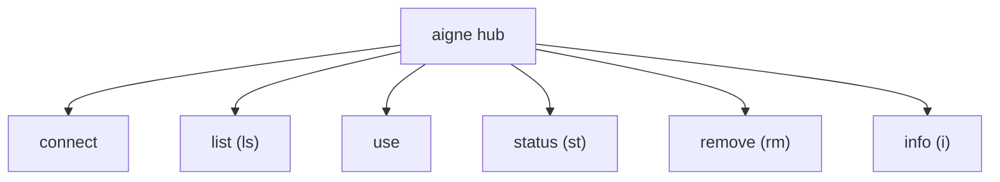

# aigne hub

`aigne hub` 命令是管理 AIGNE Hub 连接的主要工具。Hub 提供对高级模型的访问、跟踪额度使用情况，并提供其他中心化服务。该命令组允许您连接到不同的 Hub 实例，在它们之间切换，并监控您的账户状态。

## 命令概述

`hub` 命令是管理连接的多个子命令的入口。



---

## `connect [url]`

连接到一个新的 AIGNE Hub 实例。如果您在运行命令时不提供 URL，它将启动一个交互式提示，引导您连接到官方 AIGNE Hub 或自定义 Hub。

### 用法

**交互模式**

```bash
aigne hub connect
```
这将显示以下选项：

```text
? 选择要连接的 hub：
❯ 官方 Hub (https://hub.aigne.io)
  自定义 Hub URL
```

**直接模式**

将 URL 作为参数提供以进行非交互式连接。

```bash
aigne hub connect https://your-custom-hub.example.com
```

成功连接后，您的 API 密钥和 Hub URL 将保存到位于 `~/.config/aigne/env.yaml` 的配置文件中。

---

## `list` (或 `ls`)

列出所有已保存的 AIGNE Hub 连接，并指明当前活动的连接。

### 用法

```bash
aigne hub list
```

### 输出示例

该命令会显示一个包含所有已配置 Hub 的表格。

```text
已连接的 AIGNE Hubs:

┌───────────────────────────────────────────┬────────┐
│ URL                                       │ 活动   │
├───────────────────────────────────────────┼────────┤
│ https://hub.aigne.io                      │ 是     │
├───────────────────────────────────────────┼────────┤
│ https://your-custom-hub.example.com       │ 否     │
└───────────────────────────────────────────┴────────┘
使用 'aigne hub use' 切换到不同的 hub。
```

---

## `use`

切换当前活动的 AIGNE Hub 连接。当命令需要 Hub 服务时（例如使用 Hub 提供的模型运行 `aigne run`），将使用当前活动的 Hub。

### 用法

```bash
aigne hub use
```

该命令会以交互式列表的形式显示您已保存的 Hubs，让您可以选择要设置为当前活动连接的 Hub。

```text
? 选择要切换到的 hub:
❯ https://hub.aigne.io
  https://your-custom-hub.example.com
```

---

## `status` (或 `st`)

显示当前活动的 AIGNE Hub 的 URL。

### 用法

```bash
aigne hub status
```

### 输出示例

```text
当前活动的 hub: https://hub.aigne.io - 在线
```

---

## `remove` (或 `rm`)

从您的配置中移除已保存的 AIGNE Hub 连接。

### 用法

```bash
aigne hub remove
```

该命令会启动一个交互式提示，让您可以选择要删除的已保存 Hub 连接。

---

## `info` (或 `i`)

显示所选 Hub 连接的详细账户和状态信息。

### 用法

```bash
aigne hub info
```

该命令会首先提示您选择一个已配置的 Hub。然后，它会从该 Hub 获取并显示您的用户资料、连接状态、额度余额以及相关链接。

### 输出示例

输出内容为您在所选 Hub 上账户的综合摘要。请注意，只有当 Hub 启用了此功能时，才会显示额度和链接信息。

```text
AIGNE Hub 连接
──────────────────────────────────────────────
Hub:         https://hub.aigne.io
状态:        已连接 ✅

用户:
  姓名:      Jane Doe
  DID:       did:abt:z123abc...
  邮箱:      jane.doe@example.com

额度:
  已用:      5,432
  总量:      20,000

链接:
  支付:      https://hub.aigne.io/billing
  个人资料:  https://hub.aigne.io/profile
```

这组命令让您可以全面控制您的 AIGNE Hub 连接。