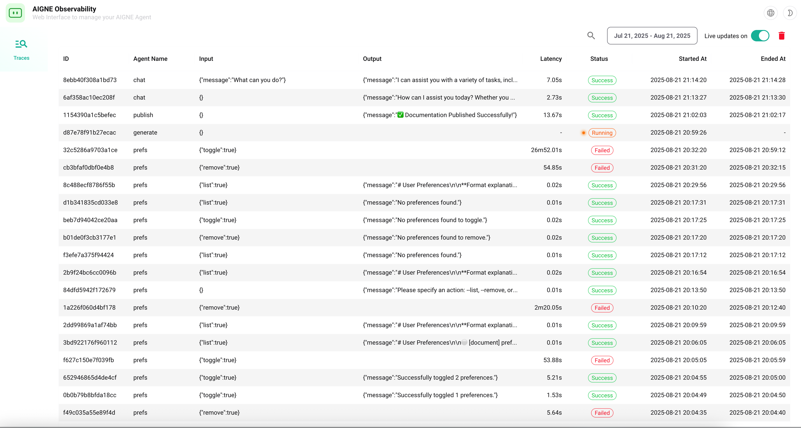

# aigne observe

`aigne observe` コマンドは、エージェントの実行データを監視および分析するためのローカルウェブサーバーを起動します。トレースの検査、詳細な呼び出し情報の表示、実行中のエージェントの振る舞いの理解を可能にする、ユーザーフレンドリーなインターフェースを提供します。このツールは、デバッグ、パフォーマンスチューニング、そしてエージェントがどのように情報を処理し、さまざまなツールやモデルと対話するかについての深い洞察を得るために不可欠です。

## 使用方法

オブザーバビリティサーバーを起動するには、ターミナルで次のコマンドを実行します。

```bash 使用方法 icon=lucide:terminal
aigne observe [options]
```

起動すると、CLI はサーバーの URL とローカルのオブザーバビリティデータベースへのパスを出力します。



## 仕組み

`observe` コマンドは、AIGNE がすべての実行トレースを保存するローカルの SQLite データベースから読み取るウェブアプリケーションを起動します。エージェントを実行するたび（`aigne run` または `aigne serve-mcp` を使用）、フレームワークは実行フローの詳細なログを自動的に記録します。これらのログは、オブザーバビリティ UI で検査できるようになります。

UI を使用すると、記録されたすべてのトレースのリストを閲覧し、特定のものにドリルダウンして、入力、出力、ツール呼び出し、モデルの応答など、エージェントの操作のステップバイステップの内訳を確認できます。


## オプション

<x-field data-name="--host" data-type="string" data-default="localhost" data-desc="サーバーのホストアドレスを指定します。ローカルネットワーク上の他のデバイスにサーバーを公開するには `0.0.0.0` を使用します。"></x-field>
<x-field data-name="--port" data-type="number" data-default="7890" data-desc="サーバーがリッスンするポート番号を設定します。指定されたポートが利用できない場合、次に利用可能なポートを探します。`PORT` 環境変数を介して設定することもできます。"></x-field>

## 例

### デフォルトポートでサーバーを起動する

オプションなしでコマンドを実行すると、デフォルト設定でサーバーが起動します。

```bash デフォルト設定で起動 icon=lucide:play
aigne observe
```

**期待される出力:**

```text コンソール出力
Observability database path: /path/to/your/project/.aigne/observability.db
Observability server is running at http://localhost:7890
```

その後、ウェブブラウザで `http://localhost:7890` を開いて UI にアクセスできます。

### 特定のポートでサーバーを起動する

`--port` オプションを使用して、異なるポートを指定します。

```bash カスタムポートで起動 icon=lucide:play-circle
aigne observe --port 8080
```

これにより、サーバーは `http://localhost:8080` で起動します（8080 が使用中の場合は、次に利用可能なポートで起動します）。

### サーバーをローカルネットワークに公開する

ネットワーク上の他のデバイスがオブザーバビリティ UI にアクセスできるようにするには、ホストを `0.0.0.0` に設定します。

```bash サーバーを公開する icon=lucide:globe
aigne observe --host 0.0.0.0
```

サーバーは `http://<your-local-ip>:7890` を介してアクセス可能になります。