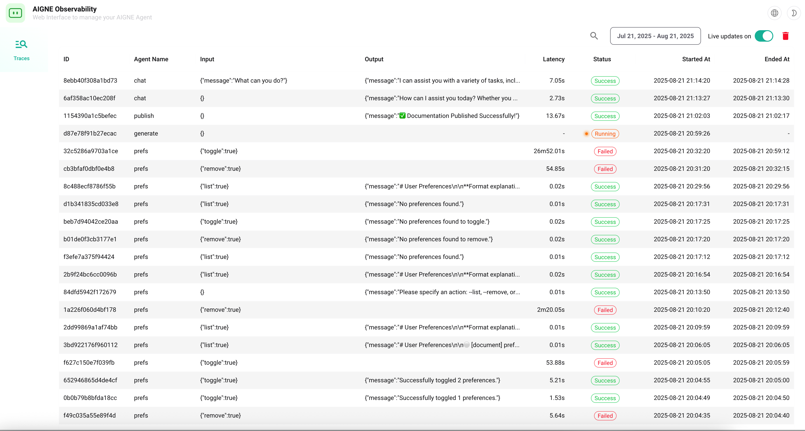

# aigne observe

The `aigne observe` command starts a local web server to help you visualize and analyze agent execution traces. This is an essential tool for debugging, monitoring performance, and understanding the step-by-step behavior of your agents.

When you run your agents, the AIGNE framework automatically captures detailed observability data. The `observe` command provides a user interface to explore this data.

## Usage

```bash
aigne observe [options]
```

Upon starting, the command will print the path to the local observability database and the URL to access the web interface.

```text
Observability database path: /path/to/your/project/.aigne/observability.db
Observability server listening on: http://localhost:7890
```

## Options

| Option | Type | Description |
| :--- | :--- | :--- |
| `--host` | `string` | Specifies the host to run the server on. Use `0.0.0.0` to expose the server to your local network. Defaults to `localhost`. |
| `--port` | `number` | Specifies the port for the server. If not provided, it will try the `PORT` environment variable, or default to `7890`. |

## Examples

### Start the server on the default port

Run the command in your project directory to start the server on `http://localhost:7890`.

```bash
aigne observe
```

### Start the server on a custom port

Use the `--port` option to specify a different port.

```bash
aigne observe --port 8000
```

### Expose the server to your network

Use `--host 0.0.0.0` to make the observability interface accessible from other devices on the same network.

```bash
aigne observe --host 0.0.0.0 --port 8080
```

## The Observability Interface

Once the server is running, you can open the provided URL in your browser to view the agent execution data.

### Traces Dashboard

The main dashboard lists all the recorded agent execution traces, giving you a high-level overview of recent activity.



### Trace Details View

Clicking on a specific trace will take you to a detailed view. Here you can inspect the complete execution flow, including model inputs and outputs, tool calls, intermediate steps, and performance metrics for each stage of the agent's run.

