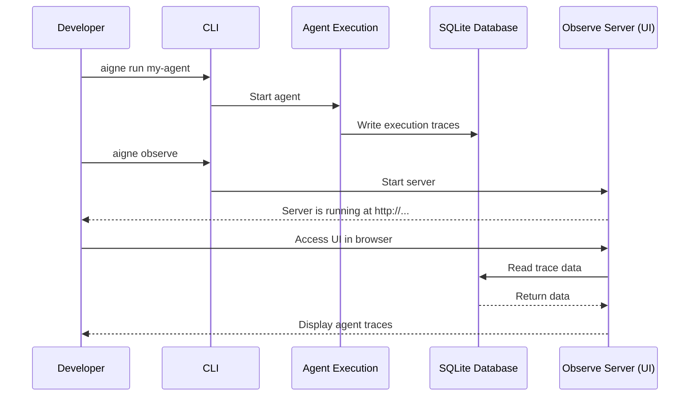

# aigne observe

The `aigne observe` command launches a local web server for monitoring, debugging, and analyzing the execution of your agents. It provides a user interface to inspect detailed traces, helping you understand agent behavior and diagnose issues.

When you run an agent, its execution data is automatically recorded. The observability server reads this data and presents it in a web-based UI, allowing you to visualize the entire lifecycle of an agent's task.


## Usage

To start the server, run the command from your terminal. It will automatically detect an available port and provide a URL to access the interface.

```bash
# Start the observability server on a default port (e.g., 7890)
aigne observe
```

Upon startup, the console will display the path to the observability database and the URL where the server is running:

```console
Observability database path: /path/to/your/project/.aigne/observability.db
Observability server listening on http://localhost:7890
```

## How It Works

The observability system captures data during agent execution and stores it locally in a SQLite database. The `aigne observe` command starts a local web server that reads this data and presents it in a user-friendly interface for analysis.



Once the server is running and an agent has been executed, you can navigate to the provided URL in your browser to view detailed traces of each run.


## Options

The `observe` command accepts the following options to customize its behavior.

| Option   | Type     | Description                                                                                                                                                             | Default                |
|----------|----------|-------------------------------------------------------------------------------------------------------------------------------------------------------------------------|------------------------|
| `--host` | `string` | The host to run the server on. Use `0.0.0.0` to expose the server to other devices on your network.                                                                     | `localhost`            |
| `--port` | `number` | The port to run the server on. If the specified port is unavailable, it will automatically find the next open port. If unspecified, it uses the `PORT` environment variable or defaults to `7890`. | `7890` or `process.env.PORT` |

## Examples

### Start the server on a specific port

If you want to run the server on a different port, such as `3001`, use the `--port` option.

```bash
aigne observe --port 3001
```

### Expose the server to your network

To make the observability UI accessible from other machines on your local network, set the host to `0.0.0.0`.

```bash
aigne observe --host 0.0.0.0
```

This is useful for team collaboration or accessing the UI from a different device on the same network.