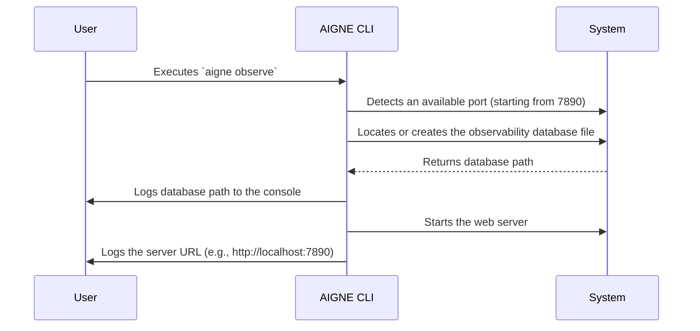

# aigne observe

The `aigne observe` command launches a local web server to provide a user interface for viewing and analyzing agent execution traces. This tool is essential for debugging, monitoring performance, and understanding the step-by-step behavior of your agents. 

When started, the command reports the location of the local SQLite database used to store observability data and provides a URL to access the web interface.

## Usage

```bash
aigne observe [options]
```

## Options

| Option | Type     | Description                                                                                                              | Default     |
| :------- | :------- | :----------------------------------------------------------------------------------------------------------------------- | :---------- |
| `--host` | `string` | The network host to bind the server to. Use `0.0.0.0` to make the server accessible from other machines on the network. | `localhost` |
| `--port` | `number` | The port number for the server to listen on. If the specified port is unavailable, it will try to find the next open one. | `7890`      |

## How It Works

The `observe` command initiates a process to serve the observability UI. Here is a typical startup sequence:



## Examples

### Start the Server with Default Settings

To start the server on the default host (`localhost`) and port (`7890`), run the command without any options.

```bash
aigne observe
```

This will produce output similar to the following, indicating the database location and the server's address:

```console
Observability database path: /Users/yourname/.config/aigne/observability.sqlite
Observability server listening on http://localhost:7890
```

You can then open `http://localhost:7890` in your web browser to view the agent traces.

### Start on a Custom Port and Expose Publicly

To run the server on a different port and make it accessible to other devices on your network, use the `--port` and `--host` options.

```bash
aigne observe --port 3001 --host 0.0.0.0
```

This command starts the server on port `3001` and binds it to `0.0.0.0`, allowing you to access the UI from other machines via your computer's local IP address (e.g., `http://192.168.1.10:3001`).

---

The observability server provides a powerful view into your agent's execution. To generate data that you can inspect, run an agent using the [`aigne run`](./command-reference-run.md) command.