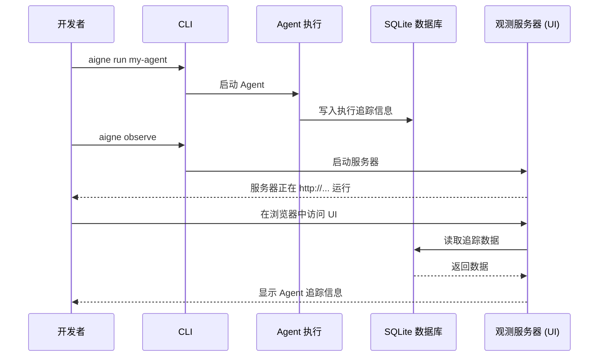

# aigne observe

`aigne observe` 命令会启动一个本地 Web 服务器，用于监控、调试和分析 Agent 的执行情况。它提供了一个用户界面来检查详细的追踪信息，帮助你理解 Agent 的行为并诊断问题。

当你运行 Agent 时，其执行数据会被自动记录。可观测性服务器会读取这些数据，并在一个基于 Web 的用户界面中呈现，让你能够可视化 Agent 任务的整个生命周期。


## 用法

要启动服务器，请在终端中运行该命令。它会自动检测一个可用端口，并提供一个访问该界面的 URL。

```bash
# 在默认端口（例如 7890）上启动可观测性服务器
aigne observe
```

启动后，控制台将显示可观测性数据库的路径以及服务器正在运行的 URL：

```console
可观测性数据库路径： /path/to/your/project/.aigne/observability.db
可观测性服务器正在监听 http://localhost:7890
```

## 工作原理

可观测性系统在 Agent 执行期间捕获数据，并将其本地存储在 SQLite 数据库中。`aigne observe` 命令会启动一个本地 Web 服务器，该服务器读取这些数据，并在一个用户友好的界面中呈现以供分析。



一旦服务器开始运行且 Agent 已执行过，你便可以在浏览器中访问所提供的 URL，以查看每次运行的详细追踪信息。


## 选项

`observe` 命令接受以下选项以自定义其行为。

| 选项   | 类型     | 描述                                                                                                                                                             | 默认值                |
|----------|----------|-------------------------------------------------------------------------------------------------------------------------------------------------------------------------|------------------------|
| `--host` | `string` | 运行服务器的主机。使用 `0.0.0.0` 可将服务器暴露给你网络上的其他设备。                                                                     | `localhost`            |
| `--port` | `number` | 运行服务器的端口。如果指定端口不可用，它将自动查找下一个可用端口。如果未指定，则使用 `PORT` 环境变量或默认为 `7890`。 | `7890` 或 `process.env.PORT` |

## 示例

### 在指定端口上启动服务器

如果你想在不同的端口（例如 `3001`）上运行服务器，请使用 `--port` 选项。

```bash
aigne observe --port 3001
```

### 公开暴露服务器

要使可观测性 UI 能从你本地网络上的其他计算机访问，请将主机设置为 `0.0.0.0`。

```bash
aigne observe --host 0.0.0.0
```

这允许你从同一网络上的其他设备访问 UI，对于团队协作或在移动设备上进行测试非常有用。
