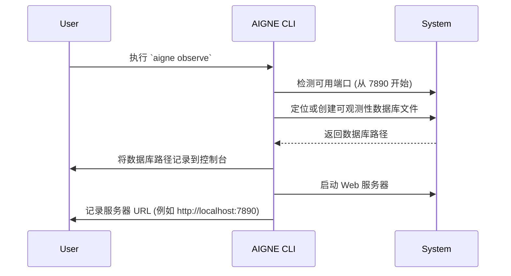

# aigne observe

`aigne observe` 命令会启动一个本地 Web 服务器，提供一个用户界面，用于查看和分析 Agent 执行轨迹。该工具对于调试、监控性能以及理解 Agent 的逐步行为至关重要。

启动后，该命令会报告用于存储可观测性数据的本地 SQLite 数据库的位置，并提供一个用于访问 Web 界面的 URL。

## 用法

```bash
aigne observe [options]
```

## 选项

| 选项 | 类型 | 描述 | 默认值 |
| :------- | :------- | :----------------------------------------------------------------------------------------------------------------------- | :---------- |
| `--host` | `string` | 将服务器绑定到的网络主机。使用 `0.0.0.0` 可使服务器从网络上的其他机器访问。 | `localhost` |
| `--port` | `number` | 服务器监听的端口号。如果指定端口不可用，它将尝试寻找下一个可用端口。 | `7890`      |

## 工作原理

`observe` 命令会启动一个进程来提供可观测性 UI。以下是一个典型的启动序列：



## 示例

### 使用默认设置启动服务器

要在默认主机 (`localhost`) 和端口 (`7890`) 上启动服务器，请不带任何选项运行该命令。

```bash
aigne observe
```

这将产生类似以下的输出，指示数据库位置和服务器地址：

```console
Observability database path: /Users/yourname/.config/aigne/observability.sqlite
Observability server listening on http://localhost:7890
```

然后，你可以在 Web 浏览器中打开 `http://localhost:7890` 来查看 Agent 轨迹。

### 在自定义端口上启动并公开访问

要在不同端口上运行服务器并使其可被网络上的其他设备访问，请使用 `--port` 和 `--host` 选项。

```bash
aigne observe --port 3001 --host 0.0.0.0
```

此命令在端口 `3001` 上启动服务器并将其绑定到 `0.0.0.0`，从而允许你通过计算机的本地 IP 地址（例如 `http://192.168.1.10:3001`）从其他机器访问 UI。

---

可观测性服务器提供了对 Agent 执行的强大视图。要生成可供检查的数据，请使用 [`aigne run`](./command-reference-run.md) 命令运行一个 Agent。