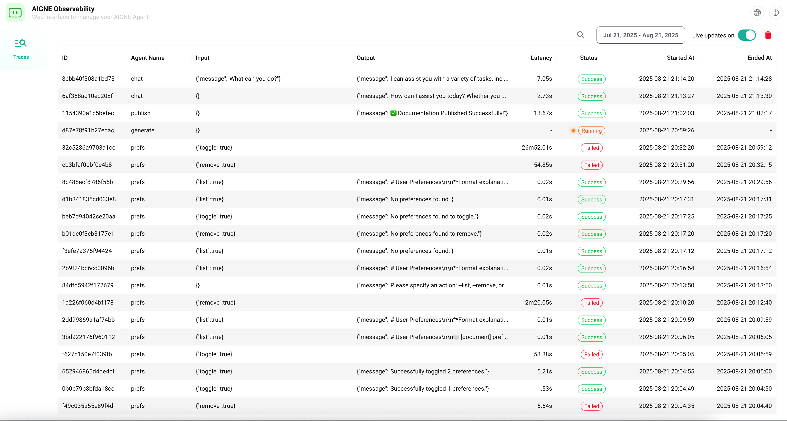

# aigne observe

`aigne observe` 命令会启动一个本地 Web 服务器，以帮助你可视化和分析 Agent 执行轨迹。这是一个用于调试、监控性能和理解 Agent 逐步行为的重要工具。

当你使用 `aigne run` 等命令运行 Agent 时，AIGNE 框架会自动捕获详细的可观察性数据。`observe` 命令提供了一个用户友好的界面来浏览这些已存储的数据。

## 数据流

下图说明了 Agent 执行数据的捕获和可视化过程：

```d2
direction: down

agent-execution: {
  label: "Agent 执行\n（例如，aigne run）"
  shape: rectangle
}

aigne-framework: {
  label: "AIGNE 框架"
  shape: package
}

db: {
  label: "可观察性数据库\n(.aigne/observability.db)"
  shape: cylinder
}

observe-cmd: {
  label: "`aigne observe` 命令"
  shape: rectangle
}

web-server: {
  label: "本地 Web 服务器"
  shape: rectangle
}

browser: {
  label: "用户浏览器"
  shape: rectangle
}

agent-execution -> aigne-framework: "1. 触发 Agent"
aigne-framework -> db: "2. 捕获并存储轨迹"
observe-cmd -> web-server: "3. 启动服务器"
web-server -> db: "4. 读取轨迹数据"
browser -> web-server: "5. 访问用户界面"
```

## 用法

在项目根目录下运行以下命令以启动服务器：

```bash
aigne observe [options]
```

启动后，该命令会输出本地可观察性数据库的路径和访问 Web 界面的 URL。

```text
可观察性数据库路径：/path/to/your/project/.aigne/observability.db
可观察性服务器监听于：http://localhost:7890
```

## 选项

| Option   | Type     | 描述                                                                                                       | Default     |
| :------- | :------- | :----------------------------------------------------------------------------------------------------------------- |:------------|
| `--host` | `string` | 指定运行服务器的主机。使用 `0.0.0.0` 可将服务器暴露到本地网络。 | `localhost` |
| `--port` | `number` | 指定服务器的端口。如果未提供，则使用 `PORT` 环境变量或回退到 `7890`。 | `7890`      |

## 示例

### 在默认端口上启动服务器

在项目目录中运行该命令，以在 `http://localhost:7890` 启动服务器。

```bash
aigne observe
```

### 在自定义端口上启动服务器

使用 `--port` 选项指定一个不同的端口。

```bash
aigne observe --port 8000
```

### 将服务器暴露到你的网络

使用 `--host 0.0.0.0` 可使可观察性界面能从同一网络上的其他设备访问。

```bash
aigne observe --host 0.0.0.0 --port 8080
```

## 可观察性界面

服务器运行后，你可以在浏览器中打开提供的 URL 以查看 Agent 执行数据。

### 轨迹仪表板

主仪表板列出了所有已记录的 Agent 执行轨迹，让你对近期活动有一个宏观的了解。



### 轨迹详情视图

点击某条具体轨迹会进入详情视图。在此，你可以查看完整的执行流程，包括模型输入与输出、工具调用、中间步骤以及 Agent 运行各阶段的性能指标。

