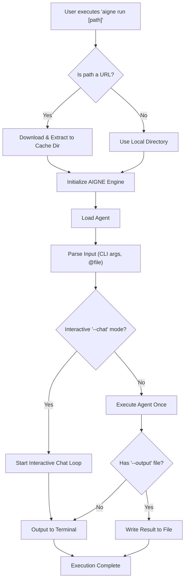

# aigne run

The `aigne run` command is the primary tool for executing an AIGNE agent. It can run agents from a local directory or a remote URL, making it versatile for both development and deployment. The command supports single-shot execution, interactive chat sessions, and extensive configuration for models, inputs, and outputs.

## Execution Flow

The command follows a clear sequence to prepare the environment, load the agent, and process the request. This includes handling remote packages, initializing the AIGNE engine, parsing inputs, and directing the final output.



## Usage

```bash
# Basic usage
aigne run [path] [options]

# Using the URL alias for remote agents
aigne run --url <remote_url> [options]
```

### Positional Arguments

| Argument | Description                                                 | Type     | Default | Alias |
|----------|-------------------------------------------------------------|----------|---------|-------|
| `path`   | Path to the local agents directory or a URL to a remote AIGNE project. | `string` | `.`     | `url`   |

## Options

This table details the options available for the `run` command to customize agent execution.

| Option                 | Alias | Description                                                                                             | Type      | Default                      |
|------------------------|-------|---------------------------------------------------------------------------------------------------------|-----------|------------------------------|
| `--entry-agent`        |       | Specifies the name of the agent to run. If omitted, the first agent found in the project is used.       | `string`  | The first agent found        |
| `--chat`               |       | Starts an interactive chat loop with the agent in the terminal. Requires a TTY environment.               | `boolean` | `false`                      |
| `--model`              |       | Defines the AI model to use, in the format `provider[:model]`. E.g., `openai` or `openai:gpt-4o-mini`.       | `string`  | `openai`                     |
| `--input`              | `-i`  | Provides input to the agent. Can be used multiple times. Use the `@<file>` syntax to read input from a file. | `array`   | -                            |
| `--format`             |       | Specifies the format of the input when it's structured data.                                            | `string`  | `text`                       |
| `--output`             | `-o`  | Specifies a file path to save the execution result. The output is printed to stdout by default.         | `string`  | -                            |
| `--output-key`         |       | The key in the agent's result object to save to the output file.                                        | `string`  | `output`                     |
| `--force`              |       | If an output file exists, it will be overwritten. Also creates the output directory if it doesn't exist. | `boolean` | `false`                      |
| `--cache-dir`          |       | A directory for downloading and caching remote packages when running from a URL. Defaults to `~/.aigne/`.   | `string`  | `~/.aigne/<hashed_url>`      |
| `--temperature`        |       | Controls randomness (0.0-2.0). Higher values result in more random outputs.                             | `number`  | -                            |
| `--top-p`              |       | Controls diversity via nucleus sampling (0.0-1.0).                                                      | `number`  | -                            |
| `--presence-penalty`   |       | Penalizes repeating tokens (-2.0 to 2.0).                                                               | `number`  | -                            |
| `--frequency-penalty`  |       | Penalizes frequent tokens (-2.0 to 2.0).                                                                | `number`  | -                            |
| `--log-level`          |       | Sets the verbosity of logs. Available levels: `silent`, `error`, `warn`, `info`, `debug`, `trace`.       | `string`  | `silent`                     |
| `--aigne-hub-url`      |       | Specifies a custom AIGNE Hub service URL for fetching remote models or agent definitions.                 | `string`  | -                            |

## Examples

### Run the Default Agent in the Current Directory

This is the simplest use case. AIGNE CLI will look for an `aigne.yaml` file and run the first agent defined.

```bash
aigne run
```

### Run a Specific Agent by Name

Use the `--entry-agent` option to specify which agent to run if your project contains multiple agents.

```bash
aigne run --entry-agent article_summarizer
```

### Run an Agent from a Remote URL

The `path` argument can be a URL to a Git repository or a tarball. The project will be downloaded and cached locally.

```bash
aigne run https://github.com/your-org/your-aigne-project.git
```

### Start an Interactive Chat Session

Use the `--chat` flag to have a continuous conversation with your agent directly in the terminal.

```bash
aigne run --entry-agent chatbot --chat
```

### Provide Input from the Command Line and a File

You can pass input using the `--input` flag. To pass the content of a file, prefix the path with `@`.

```bash
aigne run --input "Summarize the following document." --input @./report.txt
```

### Provide Structured Input (JSON/YAML)

For agents that expect structured input (e.g., a Zod schema with multiple fields), you can provide it directly or from a file.

```bash
# Provide JSON from a string
aigne run --entry-agent data_analyzer --format json --input '{"source": "sales.csv", "query": "total revenue"}'

# Provide YAML from a file
aigne run --entry-agent image_generator --input @./config.yaml
```

*File: config.yaml*
```yaml
prompt: "A futuristic cityscape at sunset"
style: "cyberpunk"
resolution: "1024x1024"
```

### Save Agent Output to a File

Use `--output` to direct the result to a file. With `--output-key`, you can specify which part of the agent's result to save.

```bash
aigne run --input "Write a short story about a space explorer." --output ./story.md --output-key final_story
```

### Use a Different Model and Set Parameters

Override the default model and fine-tune its parameters for a specific run.

```bash
aigne run --model openai:gpt-4o-mini --temperature 0.8 --input "Tell me a joke."
```

---

Now that you understand how to execute agents, you might want to serve them over an API. Proceed to the [`aigne serve-mcp`](./command-reference-serve-mcp.md) command reference to learn more.
