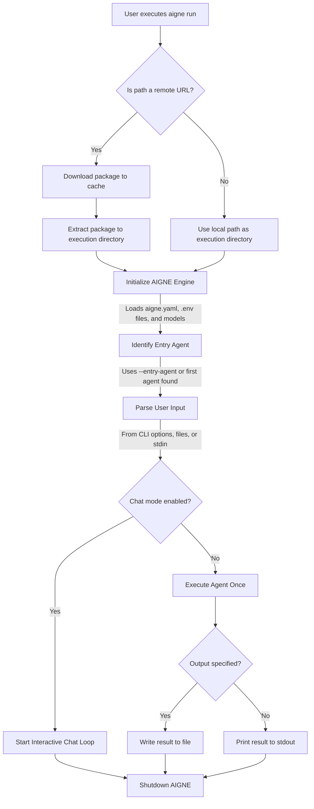

# aigne run

The `aigne run` command executes an agent, serving as the primary tool for testing, debugging, and interacting with your AIGNE agents directly from the terminal. It can run agents from a local directory or a remote URL, supports interactive chat sessions, and offers extensive options for configuring models and handling input/output.

## Synopsis

```bash
# Run an agent from the current directory
aigne run

# Run an agent from a specific local path
aigne run --path /path/to/your/agent

# Run an agent from a remote URL
aigne run --url https://github.com/user/repo/my-agent.git

# Run a specific agent within a project
aigne run --entry-agent my-specific-agent

# Start an interactive chat session
aigne run --chat
```

## How It Works

The `run` command follows a clear sequence to prepare the environment and execute an agent. This process ensures that both local and remote agents are handled consistently.



## Usage Examples

### Running a Local Agent

Execute the default agent defined in the project located in the current directory.

```bash
# Assumes the current directory is an AIGNE project
aigne run
```

To run an agent from a different directory, use the `--path` option.

```bash
aigne run --path ./my-other-project
```

### Running a Remote Agent

You can execute agents directly from a remote URL. The CLI will download and cache the project before running it.

```bash
aigne run --url https://example.com/path/to/aigne-project.tar.gz
```

By default, remote agents are cached in `~/.aigne`. You can specify a custom cache directory:

```bash
aigne run --url <URL> --cache-dir ./temp-agent-cache
```

### Starting an Interactive Chat Session

For conversational agents, the `--chat` flag starts an interactive loop in your terminal, allowing you to have a back-and-forth conversation.

```bash
aigne run --chat
```

This will launch a session where you can type your inputs and see the agent's responses in real-time.


### Providing Input to an Agent

The CLI offers multiple ways to provide input, accommodating simple text, structured data, and file-based prompts.

**1. Agent-Specific Arguments**

If your agent's input schema is defined, the CLI automatically generates corresponding command-line arguments.

```bash
# If the agent expects 'topic' and 'style' inputs
aigne run --topic "AI in software development" --style "formal"
```

**2. General Input with `--input`**

Use the `--input` (or `-i`) flag for general-purpose input. This is typically mapped to the agent's primary input key.

```bash
aigne run --input "Summarize the key features of the AIGNE framework."
```

**3. Input from a File**

To pass the content of a file as input, prefix the file path with `@`.

```bash
# The content of prompt.txt will be used as input
aigne run --input @prompt.txt
```

**4. Structured Input (JSON/YAML)**

For agents that expect structured data, you can provide a JSON or YAML file. The CLI infers the format from the file extension (`.json`, `.yaml`, `.yml`).

```bash
# The CLI infers the format from the file extension
aigne run --input @data.json

# You can also specify the format explicitly
aigne run --input @data.txt --format json
```

### Controlling the Output

By default, the agent's final result is printed to standard output. You can redirect this to a file using the `--output` (or `-o`) option.

```bash
aigne run --input "Translate 'hello' to French" --output translation.txt
```

If the result is an object with multiple keys, `--output-key` specifies which value to save.

```bash
# Assuming the result is { translation: 'Bonjour', language: 'French' }
# This saves 'Bonjour' to the file.
aigne run --output-key translation --output result.txt
```

To overwrite an existing output file, use the `--force` flag.

```bash
aigne run --output result.txt --force
```

## Command Options

Here is a comprehensive list of options available for the `aigne run` command.

| Option | Description | Default |
|---|---|---|
| `path`, `url` | Path to the local agent directory or URL of a remote AIGNE project. | `.` |
| `--entry-agent <name>` | Specifies the name of the agent to run. If omitted, the first agent found in the project is used. | First agent found |
| `--cache-dir <dir>` | Directory to download and cache remote packages. | `~/.aigne/<hostname>/<pathname>` |
| `--chat` | Runs the agent in an interactive chat loop in the terminal. | `false` |
| `--model <provider[:model]>` | AI model to use, e.g., `openai` or `openai:gpt-4o-mini`. | `openai` |
| `--temperature <value>` | Controls randomness (0.0-2.0). Higher values are more random. | - |
| `--top-p <value>` | Controls diversity via nucleus sampling (0.0-1.0). | - |
| `--presence-penalty <value>` | Penalizes repeating tokens (-2.0 to 2.0). | - |
| `--frequency-penalty <value>` | Penalizes frequent tokens (-2.0 to 2.0). | - |
| `--input <value>`, `-i <value>` | Input to the agent. Use `@<file>` to read from a file. Can be specified multiple times. | - |
| `--format <type>` | Input format when reading from files or stdin. Can be `text`, `json`, or `yaml`. | `text` |
| `--output <file>`, `-o <file>` | File path to save the result. Defaults to standard output. | `stdout` |
| `--output-key <key>` | The key in the result object to save to the output file. | `output` |
| `--force` | Overwrites the output file if it already exists and creates parent directories if needed. | `false` |
| `--log-level <level>` | Sets the logging level. Options: `SILENT`, `ERROR`, `WARN`, `INFO`, `DEBUG`, `TRACE`. | `SILENT` |
| `--aigne-hub-url <url>` | Custom AIGNE Hub URL for fetching remote models or agent definitions. | - |

---

With the `aigne run` command, you have a flexible tool for agent execution. After testing your agent locally, you might want to deploy it as a service. To learn how, proceed to the [`aigne serve-mcp`](./command-reference-serve-mcp.md) documentation.