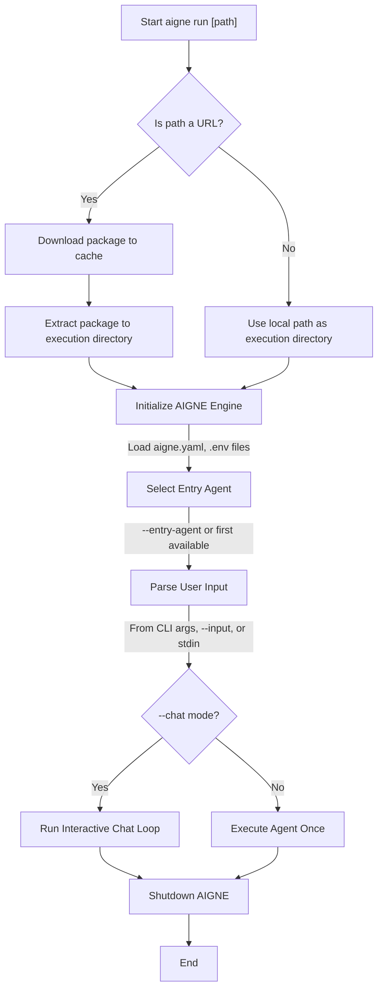

# aigne run

The `aigne run` command executes an agent from a local directory or a remote URL. It is the primary command for testing and interacting with your agents during development, offering features like interactive chat mode, dynamic model selection, and flexible input/output handling.

## Usage

```bash
# Run the default agent in the current directory
aigne run

# Run an agent from a specific local path
aigne run --path /path/to/your/project

# Run an agent from a remote Git repository or tarball URL
aigne run https://github.com/user/repo.git

# Run a specific agent within a project
aigne run --entry-agent mySpecificAgent

# Start an interactive chat session with an agent
aigne run --chat
```

## How It Works

The `run` command follows a sequence of steps to prepare the environment and execute the agent:



## Options

The `run` command supports a variety of options to customize its behavior.

### General Options

| Option | Description |
|---|---|
| `path` | Positional argument specifying the path to the agent's directory or a URL to an AIGNE project. Defaults to the current directory (`.`). |
| `--entry-agent <name>` | The name of the agent to run. If not specified, AIGNE runs the first agent defined in the project. |
| `--chat` | Runs the agent in an interactive chat loop in the terminal. This mode is ideal for conversational agents. |
| `--cache-dir <dir>` | When running from a URL, this specifies a directory to download and cache the remote package. Defaults to `~/.aigne/`. |

### Model Configuration

| Option | Description |
|---|---|
| `--model <provider[:model]>` | Specifies the AI model to use, e.g., 'openai' or 'openai:gpt-4o-mini'. This overrides the model configured in `aigne.yaml`. |
| `--temperature <value>` | Sets the model's temperature (0.0-2.0) to control randomness. |
| `--top-p <value>` | Sets the model's top-p (nucleus sampling) parameter (0.0-1.0) to control diversity. |
| `--presence-penalty <value>` | Sets the presence penalty (-2.0 to 2.0) to discourage repeating tokens. |
| `--frequency-penalty <value>` | Sets the frequency penalty (-2.0 to 2.0) to discourage frequent tokens. |

### Input & Output

| Option | Alias | Description |
|---|---|---|
| `--input <value>` | `-i` | Provides input to the agent. Can be specified multiple times. Use `@<file>` to read input from a file. |
| `--format <format>` | | Specifies the format of the input when reading from a file or stdin. Can be `json` or `yaml`. |
| `--output <file>` | `-o` | Saves the agent's result to the specified file instead of printing to stdout. |
| `--output-key <key>` | | The key in the agent's result object to save to the output file. Defaults to `output`. |
| `--force` | | If the output file already exists, this option allows overwriting it. It also creates parent directories if they don't exist. |

### Other Options

| Option | Description |
|---|---|
| `--log-level <level>` | Sets the verbosity of logs. Available levels: `debug`, `info`, `warn`, `error`, `silent`. |
| `--aigne-hub-url <url>` | Specifies a custom AIGNE Hub service URL for fetching remote models or credentials. |

## Scenarios & Examples

### Interactive Chat Mode

To have a continuous conversation with your agent, use the `--chat` flag. This is useful for testing chatbots or assistants.

```bash
aigne run --chat
```

This will start a session where you can type messages and receive responses from the agent. You can type `/exit` to end the session or `/help` for a list of available commands.


### Providing Input from a File

You can pass the content of a file as input to an agent using the `@` prefix. This is useful for complex or lengthy inputs.

```bash
# Pass the content of 'prompt.txt' as the main input
aigne run --input @prompt.txt

# If the agent's input schema has a field named 'document'
aigne run --document @document.md
```

If the file is a JSON or YAML file, the CLI can parse it automatically based on the file extension. You can also explicitly specify the format with `--format`.

```bash
# AIGNE will parse data.json and map its keys to the agent's input schema
aigne run --input @data.json

# Explicitly treat input.txt as YAML
aigne run --input @input.txt --format yaml
```

### Specifying a Model and Parameters

You can override the default model and its settings for a single run directly from the command line.

```bash
# Run the agent with a specific OpenAI model and a higher temperature for more creative responses
aigne run --model openai:gpt-4o-mini --temperature 1.2
```

### Saving Agent Output

To save the result of an agent's execution to a file, use the `--output` flag.

```bash
# Run the agent and save the entire JSON result to result.json
aigne run --input "Summarize the latest AI news" --output result.json
```

If you only need a specific field from the output (e.g., the text content), you can use `--output-key`.

```bash
# Assume the agent returns { "summary": "...", "sources": [...] }
# This command saves only the summary text to summary.txt
aigne run --input "Summarize..." --output summary.txt --output-key summary
```

For more advanced use cases, such as deploying your agent as a service, see the [`aigne serve-mcp`](./command-reference-serve-mcp.md) command.