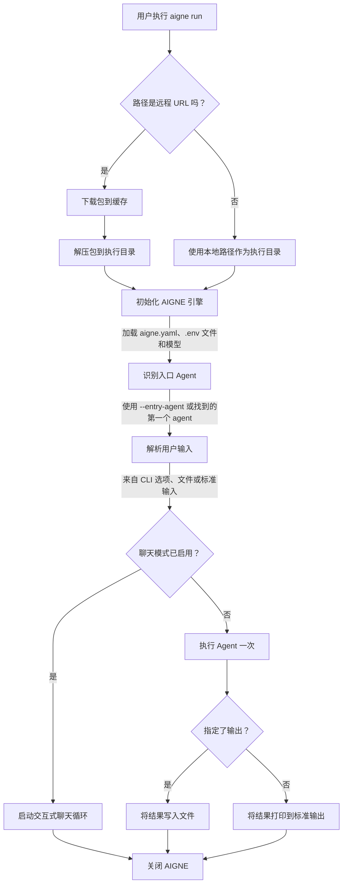

# aigne run

`aigne run` 命令用于执行一个 agent，是直接从终端测试、调试和与您的 AIGNE agent 交互的主要工具。它可以从本地目录或远程 URL 运行 agent，支持交互式聊天会话，并提供丰富的选项来配置模型和处理输入/输出。

## 概要

```bash
# 从当前目录运行一个 agent
aigne run

# 从指定的本地路径运行一个 agent
aigne run --path /path/to/your/agent

# 从远程 URL 运行一个 agent
aigne run --url https://github.com/user/repo/my-agent.git

# 在项目中运行一个特定的 agent
aigne run --entry-agent my-specific-agent

# 启动一个交互式聊天会话
aigne run --chat
```

## 执行流程

`run` 命令遵循一个清晰的顺序来准备环境并执行 agent。此过程确保本地和远程 agent 的处理方式一致。



## 用法示例

### 运行本地 Agent

执行位于当前目录的项目中定义的默认 agent。

```bash
# 假设当前目录是一个 AIGNE 项目
aigne run
```

要从不同目录运行 agent，请使用 `path` 位置参数或 `--path` 选项。

```bash
aigne run ./my-other-project
```

### 运行远程 Agent

您可以直接从远程 URL 执行 agent。CLI 将在运行前下载并缓存该项目。

```bash
aigne run --url https://example.com/path/to/aigne-project.tar.gz
```

默认情况下，远程 agent 缓存于 `~/.aigne`。您可以指定一个自定义缓存目录：

```bash
aigne run --url <URL> --cache-dir ./temp-agent-cache
```

### 启动交互式聊天会话

对于对话式 agent，`--chat` 标志会在您的终端中启动一个交互式循环，让您可以进行来回对话。

```bash
aigne run --chat
```

这将启动一个会话，您可以在其中输入内容并实时查看 agent 的响应。


### 为 Agent 提供输入

CLI 提供了多种提供输入的方式，支持简单文本、结构化数据和基于文件的提示。

**1. Agent 特定参数**

如果您的 agent 的输入结构 (input schema) 已定义（例如，在 JavaScript 或 TypeScript 文件中使用 Zod），CLI 会自动生成相应的命令行参数。

```bash
# 如果 agent 需要 'topic' 和 'style' 输入
aigne run --topic "AI in software development" --style "formal"
```

**2. 使用 `--input` 进行通用输入**

使用 `--input`（或 `-i`）标志进行通用输入。这通常会映射到 agent 的主输入键。

```bash
aigne run --input "Summarize the key features of the AIGNE framework."
```

**3. 从文件输入**

要将文件内容作为输入传递，请在文件路径前加上 `@` 前缀。

```bash
# prompt.txt 的内容将被用作输入
aigne run --input @prompt.txt
```

**4. 结构化输入 (JSON/YAML)**

对于需要结构化数据的 agent，您可以提供一个 JSON 或 YAML 文件。CLI 会根据文件扩展名（`.json`、`.yaml`、`.yml`）推断格式。

```bash
# CLI 会根据文件扩展名推断格式
aigne run --input @data.json

# 您也可以显式指定格式
aigne run --input @data.txt --format json
```

### 控制输出

默认情况下，agent 的最终结果会打印到标准输出。您可以使用 `--output`（或 `-o`）选项将其重定向到一个文件。

```bash
aigne run --input "Translate 'hello' to French" --output translation.txt
```

如果结果是具有多个键的对象，`--output-key` 用于指定要保存哪个值。

```bash
# 假设结果是 { translation: 'Bonjour', language: 'French' }
# 这会将 'Bonjour' 保存到文件中。
aigne run --output-key translation --output result.txt
```

要覆盖现有的输出文件，请使用 `--force` 标志。

```bash
aigne run --output result.txt --force
```

## 命令选项

`aigne run` 命令的可用选项完整列表如下。

| 选项 | 描述 | 默认值 |
|---|---|---|
| `path`, `url` | 本地 agent 目录的路径或远程 AIGNE 项目的 URL。 | `.` |
| `--entry-agent <name>` | 指定要运行的 agent 的名称。如果省略，则使用项目中找到的第一个 agent。 | 找到的第一个 agent |
| `--cache-dir <dir>` | 用于下载和缓存远程包的目录。 | `~/.aigne/<hostname>/<pathname>` |
| `--chat` | 在终端中以交互式聊天循环模式运行 agent。 | `false` |
| `--model <provider[:model]>` | 要使用的 AI 模型，例如 `openai` 或 `openai:gpt-4o-mini`。 | `openai` |
| `--temperature <value>` | 控制随机性（0.0-2.0）。值越高，随机性越强。 | 提供商默认值 |
| `--top-p <value>` | 通过核心采样（nucleus sampling）控制多样性（0.0-1.0）。 | 提供商默认值 |
| `--presence-penalty <value>` | 对重复的 token 进行惩罚（-2.0 到 2.0）。 | 提供商默认值 |
| `--frequency-penalty <value>` | 对高频的 token 进行惩罚（-2.0 到 2.0）。 | 提供商默认值 |
| `--input <value>`, `-i <value>` | agent 的输入。使用 `@<file>` 从文件读取。可以多次指定。 | `null` |
| `--format <type>` | 从文件或标准输入读取时的输入格式。可以是 `text`、`json` 或 `yaml`。 | `text` |
| `--output <file>`, `-o <file>` | 用于保存结果的文件路径。默认为标准输出。 | `stdout` |
| `--output-key <key>` | 结果对象中要保存到输出文件的键。 | `output` |
| `--force` | 如果输出文件已存在，则覆盖它，并根据需要创建父目录。 | `false` |
| `--log-level <level>` | 设置日志记录级别。选项：`SILENT`、`ERROR`、`WARN`、`INFO`、`DEBUG`、`TRACE`。 | `SILENT` |
| `--aigne-hub-url <url>` | 用于获取远程模型或 agent 定义的自定义 AIGNE Hub URL。 | `null` |

---

通过 `aigne run` 命令，您拥有了一个灵活的 agent 执行工具。在本地测试您的 agent 后，您可能希望将其部署为服务。要了解如何操作，请继续阅读 [`aigne serve-mcp`](./command-reference-serve-mcp.md) 文档。