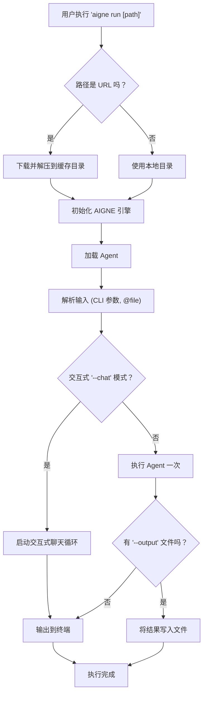

# aigne run

`aigne run` 命令是执行 AIGNE agent 的主要工具。它既可以从本地目录运行 agents，也可以从远程 URL 运行，因此在开发和部署方面都非常灵活。该命令支持单次执行、交互式聊天会话，以及对模型、输入和输出的丰富配置。

## 执行流程

该命令遵循一个明确的顺序来准备环境、加载 agent 并处理请求。这包括处理远程包、初始化 AIGNE 引擎、解析输入以及定向最终输出。



## 用法

```bash
# 基本用法
aigne run [path] [options]

# 使用 URL 别名来运行远程 agents
aigne run --url <remote_url> [options]
```

### 位置参数

| 参数 | 描述 | 类型 | 默认值 | 别名 |
|---|---|---|---|---|
| `path` | 本地 agents 目录的路径或远程 AIGNE 项目的 URL。 | `string` | `.` | `url` |

## 选项

此表详细介绍了 `run` 命令可用于自定义 agent 执行的选项。

| 选项 | 别名 | 描述 | 类型 | 默认值 |
|---|---|---|---|---|
| `--entry-agent` | | 指定要运行的 agent 的名称。如果省略，则使用项目中找到的第一个 agent。 | `string` | 找到的第一个 agent |
| `--chat` | | 在终端中与 agent 启动一个交互式聊天循环。需要 TTY 环境。 | `boolean` | `false` |
| `--model` | | 定义要使用的人工智能模型，格式为 `provider[:model]`。例如 `openai` 或 `openai:gpt-4o-mini`。 | `string` | `openai` |
| `--input` | `-i` | 为 agent 提供输入。可多次使用。使用 `@<file>` 语法从文件中读取输入。 | `array` | - |
| `--format` | | 当输入为结构化数据时，指定其格式。 | `string` | `text` |
| `--output` | `-o` | 指定一个文件路径来保存执行结果。默认情况下，输出会打印到 stdout。 | `string` | - |
| `--output-key` | | agent 结果对象中要保存到输出文件的键。 | `string` | `output` |
| `--force` | | 如果输出文件已存在，它将被覆盖。如果输出目录不存在，也会创建该目录。 | `boolean` | `false` |
| `--cache-dir` | | 当从 URL 运行时，用于下载和缓存远程包的目录。默认为 `~/.aigne/`。 | `string` | `~/.aigne/<hashed_url>` |
| `--temperature` | | 控制随机性 (0.0-2.0)。值越高，输出结果越随机。 | `number` | - |
| `--top-p` | | 通过核心采样 (nucleus sampling) 控制多样性 (0.0-1.0)。 | `number` | - |
| `--presence-penalty` | | 对重复的 token 进行惩罚 (-2.0 到 2.0)。 | `number` | - |
| `--frequency-penalty` | | 对高频的 token 进行惩罚 (-2.0 到 2.0)。 | `number` | - |
| `--log-level` | | 设置日志的详细程度。可用级别：`silent`、`error`、`warn`、`info`、`debug`、`trace`。 | `string` | `silent` |
| `--aigne-hub-url` | | 为获取远程模型或 agent 定义指定一个自定义的 AIGNE Hub 服务 URL。 | `string` | - |

## 示例

### 在当前目录中运行默认 Agent

这是最简单的用例。AIGNE CLI 将会寻找一个 `aigne.yaml` 文件并运行其中定义的第一个 agent。

```bash
aigne run
```

### 按名称运行指定的 Agent

如果你的项目包含多个 agents，使用 `--entry-agent` 选项来指定要运行哪一个 agent。

```bash
aigne run --entry-agent article_summarizer
```

### 从远程 URL 运行 Agent

`path` 参数可以是一个指向 Git 仓库或 tarball 的 URL。该项目将被下载并缓存到本地。

```bash
aigne run https://github.com/your-org/your-aigne-project.git
```

### 启动交互式聊天会话

使用 `--chat` 标志在终端中直接与你的 agent 进行连续对话。

```bash
aigne run --entry-agent chatbot --chat
```

### 从命令行和文件中提供输入

你可以使用 `--input` 标志传递输入。要传递文件内容，请在路径前加上 `@` 前缀。

```bash
aigne run --input "Summarize the following document." --input @./report.txt
```

### 提供结构化输入 (JSON/YAML)

对于期望结构化输入的 agents (例如，具有多个字段的 Zod schema)，你可以直接提供输入或从文件中读取。

```bash
# 从字符串提供 JSON
aigne run --entry-agent data_analyzer --format json --input '{"source": "sales.csv", "query": "total revenue"}'

# 从文件提供 YAML
aigne run --entry-agent image_generator --input @./config.yaml
```

*文件: config.yaml*
```yaml
prompt: "A futuristic cityscape at sunset"
style: "cyberpunk"
resolution: "1024x1024"
```

### 将 Agent 输出保存到文件

使用 `--output` 将结果定向到一个文件。通过 `--output-key`，你可以指定要保存 agent 结果的哪一部分。

```bash
aigne run --input "Write a short story about a space explorer." --output ./story.md --output-key final_story
```

### 使用不同的模型并设置参数

覆盖默认模型并为特定运行微调其参数。

```bash
aigne run --model openai:gpt-4o-mini --temperature 0.8 --input "Tell me a joke."
```

---

既然你已经了解如何执行 agents，你可能希望通过 API 来提供它们的服务。请继续阅读 [`aigne serve-mcp`](./command-reference-serve-mcp.md) 命令参考以了解更多信息。