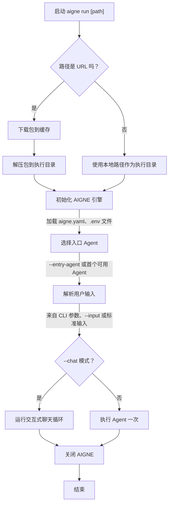

# aigne run

`aigne run` 命令可从本地目录或远程 URL 执行 Agent。它是开发过程中用于测试 Agent 并与之交互的主要命令，提供了交互式聊天模式、动态模型选择以及灵活的输入/输出处理等功能。

## 用法

```bash
# 在当前目录中运行默认 Agent
aigne run

# 从指定的本地路径运行 Agent
aigne run --path /path/to/your/project

# 从远程 Git 仓库或 tarball URL 运行 Agent
aigne run https://github.com/user/repo.git

# 在项目中运行指定的 Agent
aigne run --entry-agent mySpecificAgent

# 与 Agent 启动交互式聊天会话
aigne run --chat
```

## 工作原理

`run` 命令遵循一系列步骤来准备环境并执行 Agent：



## 选项

`run` 命令支持多种选项以自定义其行为。

### 通用选项

| Option | Description |
|---|---|
| `path` | 位置参数，指定 Agent 目录的路径或 AIGNE 项目的 URL。默认为当前目录（`.`）。 |
| `--entry-agent <name>` | 要运行的 Agent 名称。如果未指定，AIGNE 将运行项目中定义的第一个 Agent。 |
| `--chat` | 在终端中以交互式聊天循环模式运行 Agent。此模式非常适合对话式 Agent。 |
| `--cache-dir <dir>` | 从 URL 运行时，此选项指定用于下载和缓存远程包的目录。默认为 `~/.aigne/`。 |

### 模型配置

| Option | Description |
|---|---|
| `--model <provider[:model]>` | 指定要使用的 AI 模型，例如 'openai' 或 'openai:gpt-4o-mini'。此选项会覆盖 `aigne.yaml` 中配置的模型。 |
| `--temperature <value>` | 设置模型的 temperature (0.0-2.0) 以控制随机性。 |
| `--top-p <value>` | 设置模型的 top-p (nucleus sampling) 参数 (0.0-1.0) 以控制多样性。 |
| `--presence-penalty <value>` | 设置 presence penalty (-2.0 到 2.0) 以避免重复的 token。 |
| `--frequency-penalty <value>` | 设置 frequency penalty (-2.0 到 2.0) 以避免高频的 token。 |

### 输入与输出

| Option | Alias | Description |
|---|---|---|
| `--input <value>` | `-i` | 为 Agent 提供输入。可多次指定。使用 `@<file>` 从文件中读取输入。 |
| `--format <format>` | | 从文件或标准输入读取时，指定输入的格式。可以是 `json` 或 `yaml`。 |
| `--output <file>` | `-o` | 将 Agent 的结果保存到指定文件，而不是打印到标准输出。 |
| `--output-key <key>` | | Agent 结果对象中要保存到输出文件的键。默认为 `output`。 |
| `--force` | | 如果输出文件已存在，此选项允许覆盖它。如果父目录不存在，也会创建它们。 |

### 其他选项

| Option | Description |
|---|---|
| `--log-level <level>` | 设置日志的详细程度。可用级别：`debug`、`info`、`warn`、`error`、`silent`。 |
| `--aigne-hub-url <url>` | 为获取远程模型或凭证指定自定义 AIGNE Hub 服务 URL。 |

## 场景与示例

### 交互式聊天模式

要与您的 Agent 进行连续对话，请使用 `--chat` 标志。这对于测试聊天机器人或助手非常有用。

```bash
aigne run --chat
```

这将启动一个会话，您可以在其中输入消息并接收来自 Agent 的响应。您可以输入 `/exit` 来结束会话，或输入 `/help` 查看可用命令列表。


### 从文件提供输入

您可以使用 `@` 前缀将文件内容作为输入传递给 Agent。这对于复杂或冗长的输入非常有用。

```bash
# 将 'prompt.txt' 的内容作为主要输入传递
aigne run --input @prompt.txt

# 如果 Agent 的输入结构有一个名为 'document' 的字段
aigne run --document @document.md
```

如果文件是 JSON 或 YAML 文件，CLI 可以根据文件扩展名自动解析。您也可以使用 `--format` 显式指定格式。

```bash
# AIGNE 将解析 data.json 并将其键映射到 Agent 的输入结构
aigne run --input @data.json

# 显式地将 input.txt 作为 YAML 处理
aigne run --input @input.txt --format yaml
```

### 指定模型和参数

您可以直接从命令行覆盖单次运行的默认模型及其设置。

```bash
# 使用特定的 OpenAI 模型和更高的 temperature 运行 Agent，以获得更具创造性的响应
aigne run --model openai:gpt-4o-mini --temperature 1.2
```

### 保存 Agent 输出

要将 Agent 的执行结果保存到文件，请使用 `--output` 标志。

```bash
# 运行 Agent 并将完整的 JSON 结果保存到 result.json
aigne run --input "Summarize the latest AI news" --output result.json
```

如果您只需要输出中的特定字段（例如，文本内容），您可以使用 `--output-key`。

```bash
# 假设 Agent 返回 { "summary": "...", "sources": [...] }
# 此命令仅将摘要文本保存到 summary.txt
aigne run --input "Summarize..." --output summary.txt --output-key summary
```

有关更高级的用例，例如将您的 Agent 部署为服务，请参阅 [`aigne serve-mcp`](./command-reference-serve-mcp.md) 命令。