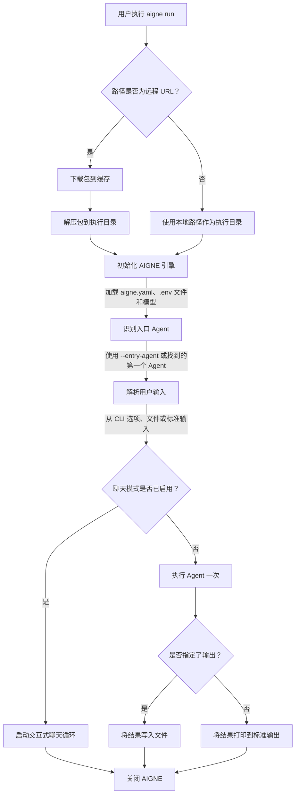

# aigne run

`aigne run` 命令用于执行 Agent，是直接从终端测试、调试 AIGNE Agent 并与之交互的主要工具。该命令可以从本地目录或远程 URL 运行 Agent，支持交互式聊天会话，并提供丰富的选项来配置模型和处理输入/输出。

## 概要

```bash
# 从当前目录运行 Agent
aigne run

# 从指定的本地路径运行 Agent
aigne run --path /path/to/your/agent

# 从远程 URL 运行 Agent
aigne run --url https://github.com/user/repo/my-agent.git

# 运行项目中的特定 Agent
aigne run --entry-agent my-specific-agent

# 启动交互式聊天会话
aigne run --chat
```

## 工作原理

`run` 命令遵循明确的顺序来准备环境并执行 Agent。此过程确保本地和远程 Agent 都能得到一致的处理。



## 使用示例

### 运行本地 Agent

执行位于当前目录项目中的默认 Agent。

```bash
# 假设当前目录是一个 AIGNE 项目
aigne run
```

要从不同目录运行 Agent，请使用 `--path` 选项。

```bash
aigne run --path ./my-other-project
```

### 运行远程 Agent

你可以直接从远程 URL 执行 Agent。CLI 会在运行前下载并缓存该项目。

```bash
aigne run --url https://example.com/path/to/aigne-project.tar.gz
```

默认情况下，远程 Agent 缓存于 `~/.aigne`。你可以指定一个自定义的缓存目录：

```bash
aigne run --url <URL> --cache-dir ./temp-agent-cache
```

### 启动交互式聊天会话

对于对话式 Agent，`--chat` 标志会在终端中启动一个交互式循环，允许你进行来回对话。

```bash
aigne run --chat
```

这将启动一个会话，你可以在其中输入内容并实时查看 Agent 的响应。


### 为 Agent 提供输入

CLI 提供多种方式来提供输入，以适应简单的文本、结构化数据和基于文件的提示。

**1. Agent 特定参数**

如果你的 Agent 定义了输入结构 (InputSchema)，CLI 会自动生成相应的命令行参数。

```bash
# 如果 Agent 需要 'topic' 和 'style' 输入
aigne run --topic "AI in software development" --style "formal"
```

**2. 使用 --input 提供通用输入**

使用 `--input`（或 `-i`）标志来提供通用输入。这通常会映射到 Agent 的主输入键。

```bash
aigne run --input "Summarize the key features of the AIGNE framework."
```

**3. 从文件输入**

要将文件内容作为输入传递，请在文件路径前加上 `@` 前缀。

```bash
# prompt.txt 的内容将被用作输入
aigne run --input @prompt.txt
```

**4. 结构化输入 (JSON/YAML)**

对于需要结构化数据的 Agent，你可以提供一个 JSON 或 YAML 文件。CLI 会根据文件扩展名（`.json`、`.yaml`、`.yml`）推断格式。

```bash
# CLI 会根据文件扩展名推断格式
aigne run --input @data.json

# 你也可以显式指定格式
aigne run --input @data.txt --format json
```

### 控制输出

默认情况下，Agent 的最终结果会打印到标准输出。你可以使用 `--output`（或 `-o`）选项将其重定向到文件。

```bash
aigne run --input "Translate 'hello' to French" --output translation.txt
```

如果结果是一个包含多个键的对象，`--output-key` 用于指定要保存哪个值。

```bash
# 假设结果是 { translation: 'Bonjour', language: 'French' }
# 这会将 'Bonjour' 保存到文件中。
aigne run --output-key translation --output result.txt
```

要覆盖已存在的输出文件，请使用 `--force` 标志。

```bash
aigne run --output result.txt --force
```

## 命令选项

以下是 `aigne run` 命令可用的完整选项列表。

| 选项 | 描述 | 默认值 |
|---|---|---|
| `path`, `url` | 本地 Agent 目录的路径或远程 AIGNE 项目的 URL。 | `.` |
| `--entry-agent <name>` | 指定要运行的 Agent 的名称。如果省略，则使用项目中找到的第一个 Agent。 | 找到的第一个 Agent |
| `--cache-dir <dir>` | 用于下载和缓存远程包的目录。 | `~/.aigne/<hostname>/<pathname>` |
| `--chat` | 在终端中以交互式聊天循环模式运行 Agent。 | `false` |
| `--model <provider[:model]>` | 要使用的 AI 模型，例如 `openai` 或 `openai:gpt-4o-mini`。 | `openai` |
| `--temperature <value>` | 控制随机性 (0.0-2.0)。值越高，随机性越强。 | - |
| `--top-p <value>` | 通过核心采样控制多样性 (0.0-1.0)。 | - |
| `--presence-penalty <value>` | 对重复的词元进行惩罚 (-2.0 到 2.0)。 | - |
| `--frequency-penalty <value>` | 对高频词元进行惩罚 (-2.0 到 2.0)。 | - |
| `--input <value>`, `-i <value>` | Agent 的输入。使用 `@<file>` 从文件读取。可多次指定。 | - |
| `--format <type>` | 从文件或标准输入读取时的输入格式。可以是 `text`、`json` 或 `yaml`。 | `text` |
| `--output <file>`, `-o <file>` | 用于保存结果的文件路径。默认为标准输出。 | `stdout` |
| `--output-key <key>` | 结果对象中要保存到输出文件的键。 | `output` |
| `--force` | 如果输出文件已存在则覆盖它，并在需要时创建父目录。 | `false` |
| `--log-level <level>` | 设置日志记录级别。可选值：`SILENT`、`ERROR`、`WARN`、`INFO`、`DEBUG`、`TRACE`。 | `SILENT` |
| `--aigne-hub-url <url>` | 用于获取远程模型或 Agent 定义的自定义 AIGNE Hub URL。 | - |

---

借助 `aigne run` 命令，你就拥有了一个灵活的 Agent 执行工具。在本地测试 Agent 后，你可能会希望将其部署为服务。要了解如何操作，请继续阅读 [`aigne serve-mcp`](./command-reference-serve-mcp.md) 文档。