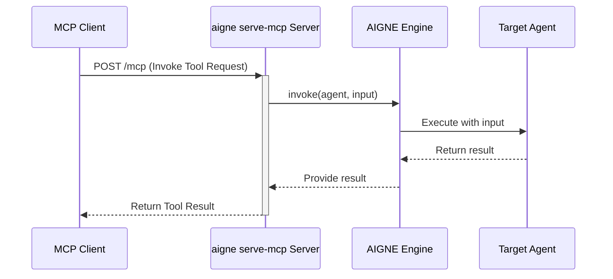

# aigne serve-mcp

The `aigne serve-mcp` command launches a local server that exposes your AIGNE agents through the Model Context Protocol (MCP). This allows external applications and services that are compatible with MCP to interact with your agents as callable tools, enabling seamless integration into larger systems.

This command is designed for backend integration, distinct from the `aigne run` command which is intended for interactive chat sessions.

## How It Works

When you run `aigne serve-mcp`, the CLI performs the following steps:

1.  **Load Project**: It loads the AIGNE project from the specified directory, parsing the `aigne.yaml` configuration.
2.  **Identify Agents**: It identifies the agents designated for exposure via the `mcpServer.agents` list in your configuration file.
3.  **Create MCP Tools**: For each designated agent, it creates a corresponding MCP tool. The agent's `name`, `description`, and `inputSchema` are used to define the tool's signature.
4.  **Start HTTP Server**: It starts an HTTP server (using Express) that listens for incoming MCP requests on a specific path (e.g., `/mcp`).
5.  **Handle Requests**: The server processes incoming tool invocation requests from MCP clients, passes the input to the corresponding AIGNE agent, and streams the result back to the client.

The following diagram illustrates the request flow:



## Usage

To serve agents from the current directory on the default port (3000):

```bash
aigne serve-mcp
```

To serve agents from a specific directory on a custom port:

```bash
aigne serve-mcp --path ./my-agents --port 3001
```

## Command Options

The `serve-mcp` command supports several options to customize its behavior:

| Option | Alias | Description | Type | Default |
|---|---|---|---|---|
| `--path` | `--url` | Path to the local agents directory or a URL to a remote AIGNE project. | `string` | `.` |
| `--host` | | The host to run the MCP server on. Use `0.0.0.0` to expose the server to the public network. | `string` | `localhost` |
| `--port` | | The port to run the MCP server on. Can also be set via the `PORT` environment variable. | `number` | `3000` |
| `--pathname` | | The URL pathname for the MCP service endpoint. | `string` | `/mcp` |
| `--aigne-hub-url` | | A custom URL for the AIGNE Hub service. This is used for fetching remote agent definitions or models. | `string` | N/A |

## Configuration

To expose an agent via the MCP server, you must explicitly list it in the `mcpServer.agents` section of your `aigne.yaml` file. Agents not listed here will not be accessible through the MCP endpoint.

**Example `aigne.yaml`:**

```yaml
# aigne.yaml

mcpServer:
  agents:
    - myCustomAgent

agents:
  - name: myCustomAgent
    description: 'A custom agent that processes user data.'
    # The inputSchema must be a ZodObject for MCP compatibility
    inputSchema:
      type: object
      properties:
        userId:
          type: string
        query:
          type: string
      required:
        - userId
    # ... other agent configuration
```

In this example, only `myCustomAgent` will be exposed as a tool on the MCP server.

## Practical Example

Let's walk through serving an agent and interacting with it using `curl`.

**1. Agent Definition**

Assume you have an agent named `text-summarizer` defined in your project.

**2. Expose the Agent**

Update your `aigne.yaml` to include it in the `mcpServer` configuration:

```yaml
# aigne.yaml

mcpServer:
  agents:
    - text-summarizer

agents:
  - name: text-summarizer
    description: 'Summarizes a given block of text.'
    inputSchema:
      type: object
      properties:
        text:
          type: string
          description: "The text to be summarized."
      required: ["text"]
    # ... additional configuration
```

**3. Start the Server**

Run the command to start the server on port 8080.

```bash
aigne serve-mcp --port 8080
```

You should see the following output, confirming the server is running:

```
MCP server is running on http://localhost:8080/mcp
```

**4. Interact with the Server**

You can now send a POST request to the `/mcp` endpoint to invoke the `text-summarizer` tool. The body of the request must follow the JSON-RPC 2.0 format expected by the MCP server.

```bash
curl -X POST http://localhost:8080/mcp \
-H "Content-Type: application/json" \
-d '{
  "jsonrpc": "2.0",
  "method": "invokeTool",
  "params": {
    "toolName": "text-summarizer",
    "input": {
      "text": "AIGNE CLI is the official command-line tool for AIGNE Framework, designed to simplify the development, testing, and deployment processes for AIGNE applications. It provides a series of useful commands to help developers quickly create projects, run agents, test code, and deploy applications."
    }
  },
  "id": "request-123"
}'
```

The server will process this request, execute the `text-summarizer` agent with the provided text, and return the result.
