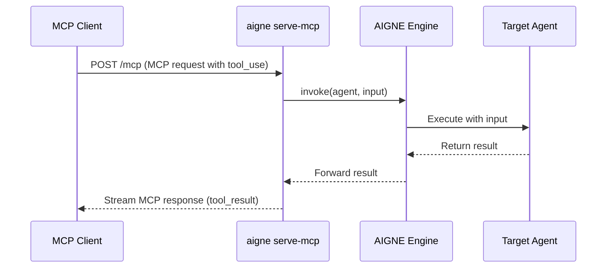

# aigne serve-mcp

The `aigne serve-mcp` command starts a local server that exposes your AIGNE agents through the [Model Context Protocol (MCP)](https://modelcontextprotocol.dev/). This allows external systems and applications compatible with MCP to interact with your agents as if they were standard tools.

This is particularly useful for integrating your agents into larger workflows or making them available to other services in a standardized, streamable way.

## Basic Usage

To start the server with default settings, navigate to your project directory and run the command:

```bash
# Start MCP server on default port 3000
aigne serve-mcp
```

This command scans the current directory for an AIGNE project, loads the agents specified for MCP, and starts an HTTP server. By default, the service endpoint is available at `http://localhost:3000/mcp`.


## How It Works

The command initializes an MCP server and dynamically registers each agent specified in your `aigne.yaml` as a callable "tool". When an MCP-compliant client sends a request to use one of these tools, the server invokes the corresponding agent with the provided input and streams the output back to the client.



## Options

You can customize the server's behavior using the following options:

| Option | Alias | Description | Type | Default |
|---|---|---|---|---|
| `--path` | `url` | Path to the agents directory or a URL to an AIGNE project. | `string` | `.` |
| `--host` | | Host to run the MCP server on. Use `0.0.0.0` to expose the server publicly. | `string` | `localhost` |
| `--port` | | Port to run the MCP server on. If not set, it uses the `PORT` environment variable or defaults to 3000. | `number` | `3000` |
| `--pathname` | | The specific URL path for the MCP service endpoint. | `string` | `/mcp` |
| `--aigne-hub-url` | | Custom AIGNE Hub service URL. Used for fetching remote agent definitions or models. | `string` | N/A |

## Examples

### Run on a different port

To avoid port conflicts, you can specify a different port.

```bash
# Start MCP server on port 8080
aigne serve-mcp --port 8080
```

### Serve agents from a specific directory

If your terminal's current working directory is not the project root, you must specify the path to your project.

```bash
# Start MCP server for agents at a specified path
aigne serve-mcp --path ./my-agents-project
```

### Expose the server to the network

To allow other devices on your local network to access the MCP server, set the host to `0.0.0.0`.

```bash
# The server will be accessible via your machine's IP address
aigne serve-mcp --host 0.0.0.0 --port 3001
```

### Change the service pathname

For reverse proxy configurations or to avoid endpoint conflicts, you can change the URL path.

```bash
# The server will be available at http://localhost:3000/api/agents
aigne serve-mcp --pathname /api/agents
```

## Project Configuration

To control which agents are exposed through the MCP server, you must add an `mcpServer` section to your `aigne.yaml` file. List the IDs of the agents you want to serve under the `agents` key.

```yaml
# aigne.yaml

name: my-project
description: A project with agents exposed via MCP.

agents:
  - id: myAgent1
    # ... agent configuration

  - id: myAgent2
    # ... agent configuration

# Expose specific agents via the MCP server
mcpServer:
  agents:
    - myAgent1
```

In this example, only `myAgent1` will be registered as a tool on the MCP server. If the `mcpServer` section or the `agents` list is omitted, no agents will be exposed.

---

After setting up your MCP server, you may want to learn more about defining the agents themselves. Proceed to the [Agents and Skills](./core-concepts-agents-and-skills.md) section for more details.