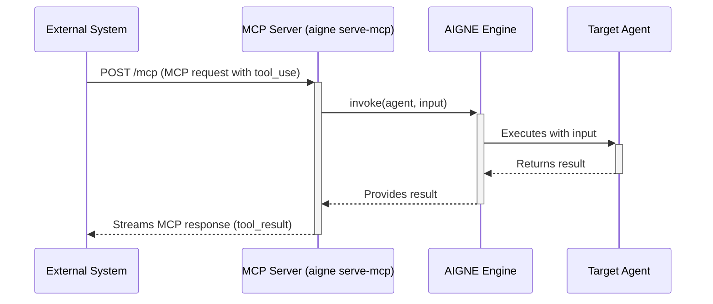

# aigne serve-mcp

`aigne serve-mcp` 命令会启动一个本地 HTTP 服务器，将你的 AIGNE Agent 暴露为符合模型上下文协议 (Model Context Protocol, MCP) 的服务。这可以实现与外部系统的无缝集成，允许它们将你的 Agent 作为标准化工具来调用。

此命令对于在面向服务的架构中部署 Agent 至关重要，其他应用程序可以通过网络使用它们的功能。

## 工作原理

当你运行 `aigne serve-mcp` 时，CLI 会执行以下操作：

1.  它从指定路径加载 AIGNE 项目配置。
2.  它识别指定用于 MCP 暴露的 Agent（通常在你的 `aigne.yaml` 文件中定义）。
3.  它启动一个 Express.js Web 服务器来监听 HTTP 请求。
4.  每个指定的 Agent 在 MCP 服务器实例中被注册为一个“工具”。
5.  服务器在配置的端点（例如 `/mcp`）上监听 `POST` 请求。当收到使用工具的有效 MCP 请求时，服务器会调用相应的 Agent，传递输入，并以 MCP 格式将 Agent 的输出流式传输回客户端。

下图说明了请求流程：



## 用法

```bash
aigne serve-mcp [options]
```

## 选项

`serve-mcp` 命令提供以下选项：

| Option | Alias | Description | Type | Default |
| --- | --- | --- | --- | --- |
| `--path` | `--url` | Agent 目录的路径或 AIGNE 项目的 URL。 | `string` | `.` |
| `--host` | | 运行 MCP 服务器的主机。使用 `0.0.0.0` 可将服务器公开。 | `string` | `localhost` |
| `--port` | | 运行 MCP 服务器的端口。如果未指定，则使用 `PORT` 环境变量或默认为 3000。 | `number` | `3000` |
| `--pathname` | | MCP 服务端点的 URL 路径名。 | `string` | `/mcp` |
| `--aigne-hub-url` | | 自定义 AIGNE Hub 服务 URL。用于获取远程 Agent 定义或模型。 | `string` | `undefined` |

## 示例

### 在当前目录中启动服务器

要在默认端口 (3000) 上为当前项目目录中定义的 Agent 提供服务，请不带任何选项运行该命令：

```bash
aigne serve-mcp
```

成功启动后，你将看到一条确认消息：

```
MCP server is running on http://localhost:3000/mcp
```

### 在指定端口和路径上运行

你可以使用 `--path` 和 `--port` 选项为你的 Agent 指定不同的目录和自定义端口。

```bash
aigne serve-mcp --path ./path/to/agents --port 8080
```

此命令会在 8080 端口上为位于 `./path/to/agents` 的项目启动服务器。

```
MCP server is running on http://localhost:8080/mcp
```

### 公开服务器

要使你的 MCP 服务器可从网络上的其他计算机访问，请将主机设置为 `0.0.0.0`。

```bash
aigne serve-mcp --host 0.0.0.0 --port 3001
```

现在，可以通过你计算机的网络 IP 地址在 3001 端口上访问该服务器。

```
MCP server is running on http://0.0.0.0:3001/mcp
```

### 在自定义路径名上提供服务

要将服务终结点从 `/mcp` 更改为其他名称（例如 `/api/agents`），请使用 `--pathname` 选项。

```bash
aigne serve-mcp --pathname /api/agents
```

服务器现在将在新的端点上监听请求。

```
MCP server is running on http://localhost:3000/api/agents
```

## 与服务器交互

服务器运行后，你可以通过向指定端点发送 `POST` 请求来与其交互。请求的正文必须是符合模型上下文协议的 JSON-RPC 2.0 对象。

例如，如果你有一个名为 `getWeather` 的 Agent，它接受 `city` 作为输入，则可以使用 `curl` 调用它：

```bash
curl -X POST http://localhost:3000/mcp \
-H "Content-Type: application/json" \
-d '{
  "jsonrpc": "2.0",
  "method": "tool_use",
  "params": {
    "name": "getWeather",
    "input": {
      "city": "San Francisco"
    }
  },
  "id": "req-123"
}'
```

服务器将流式传回响应，响应将以结果负载结束，例如：

```json
{
  "jsonrpc": "2.0",
  "result": {
    "content": [
      {
        "type": "text",
        "text": "旧金山天气晴朗，最高温度 70°F。"
      }
    ]
  },
  "id": "req-123"
}
```

这使得将你的 AIGNE Agent 与任何能够发出 HTTP 请求的应用程序集成变得非常简单。

---

`serve-mcp` 命令是将你的 AIGNE Agent 集成到更大型应用程序和服务的关键组件。要了解有关配置哪些 Agent 被暴露的更多信息，请参阅[项目配置 (aigne.yaml)](./core-concepts-project-configuration.md) 指南。
