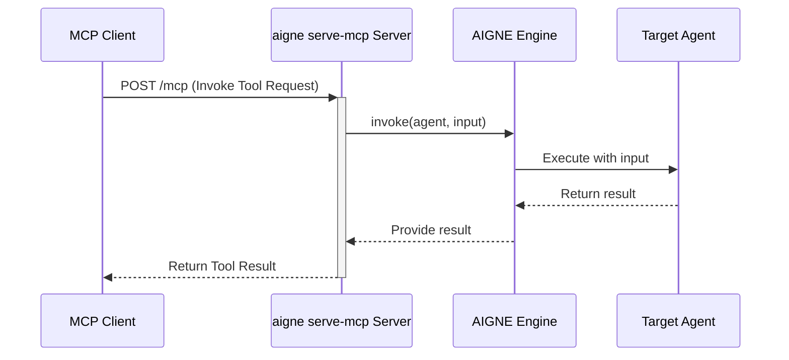

# aigne serve-mcp

`aigne serve-mcp` 命令会启动一个本地服务器，通过模型上下文协议（MCP）暴露您的 AIGNE Agent。这使得与 MCP 兼容的外部应用程序和服务能够将您的 Agent 作为可调用工具进行交互，从而实现与更大型系统的无缝集成。

该命令专为后端集成而设计，与用于交互式聊天会话的 `aigne run` 命令有所区别。

## 工作原理

当您运行 `aigne serve-mcp` 时，CLI 会执行以下步骤：

1.  **加载项目**：从指定目录加载 AIGNE 项目，并解析 `aigne.yaml` 配置文件。
2.  **识别 Agent**：通过配置文件中的 `mcpServer.agents` 列表，识别出要暴露的 Agent。
3.  **创建 MCP 工具**：为每个指定的 Agent 创建一个相应的 MCP 工具。Agent 的 `name`、`description` 和 `inputSchema` 用于定义该工具的签名。
4.  **启动 HTTP 服务器**：启动一个 HTTP 服务器（使用 Express），在特定路径（例如 `/mcp`）上监听传入的 MCP 请求。
5.  **处理请求**：服务器处理来自 MCP 客户端的传入工具调用请求，将输入传递给相应的 AIGNE Agent，并将结果以流的形式传回客户端。

下图演示了请求流程：



## 用法

在默认端口（3000）上，从当前目录提供 Agent 服务：

```bash
aigne serve-mcp
```

在自定义端口上，从指定目录提供 Agent 服务：

```bash
aigne serve-mcp --path ./my-agents --port 3001
```

## 命令选项

`serve-mcp` 命令支持多个选项，可用于自定义其行为：

| Option | Alias | Description | Type | Default |
|---|---|---|---|---|
| `--path` | `--url` | 本地 Agent 目录的路径或远程 AIGNE 项目的 URL。 | `string` | `.` |
| `--host` | | 运行 MCP 服务器的主机。使用 `0.0.0.0` 可将服务器暴露至公网。 | `string` | `localhost` |
| `--port` | | 运行 MCP 服务器的端口。也可以通过 `PORT` 环境变量进行设置。 | `number` | `3000` |
| `--pathname` | | MCP 服务端点的 URL 路径名。 | `string` | `/mcp` |
| `--aigne-hub-url` | | AIGNE Hub 服务的自定义 URL。用于获取远程 Agent 定义或模型。 | `string` | N/A |

## 配置

要通过 MCP 服务器暴露 Agent，您必须在 `aigne.yaml` 文件的 `mcpServer.agents` 部分中明确列出该 Agent。未在此处列出的 Agent 将无法通过 MCP 端点访问。

**aigne.yaml 示例：**

```yaml
# aigne.yaml

mcpServer:
  agents:
    - myCustomAgent

agents:
  - name: myCustomAgent
    description: '一个处理用户数据的自定义 agent。'
    # inputSchema 必须是 ZodObject 以兼容 MCP
    inputSchema:
      type: object
      properties:
        userId:
          type: string
        query:
          type: string
      required:
        - userId
    # ... 其他 Agent 配置
```

在此示例中，只有 `myCustomAgent` 会作为工具在 MCP 服务器上被暴露。

## 实践示例

让我们逐步演示如何提供一个 Agent 服务，并使用 `curl` 与其交互。

**1. Agent 定义**

假设您的项目中定义了一个名为 `text-summarizer` 的 Agent。

**2. 暴露 Agent**

更新您的 `aigne.yaml` 文件，将其包含在 `mcpServer` 配置中：

```yaml
# aigne.yaml

mcpServer:
  agents:
    - text-summarizer

agents:
  - name: text-summarizer
    description: '总结给定的文本块。'
    inputSchema:
      type: object
      properties:
        text:
          type: string
          description: "待总结的文本。"
      required: ["text"]
    # ... 其他配置
```

**3. 启动服务器**

运行命令，在 8080 端口上启动服务器。

```bash
aigne serve-mcp --port 8080
```

您应该会看到以下输出，确认服务器正在运行：

```
MCP server is running on http://localhost:8080/mcp
```

**4. 与服务器交互**

您现在可以向 `/mcp` 端点发送 POST 请求，以调用 `text-summarizer` 工具。请求体必须遵循 MCP 服务器所期望的 JSON-RPC 2.0 格式。

```bash
curl -X POST http://localhost:8080/mcp \
-H "Content-Type: application/json" \
-d '{
  "jsonrpc": "2.0",
  "method": "invokeTool",
  "params": {
    "toolName": "text-summarizer",
    "input": {
      "text": "AIGNE CLI 是 AIGNE 框架的官方命令行工具，旨在简化 AIGNE 应用程序的开发、测试和部署流程。它提供了一系列有用的命令，帮助开发人员快速创建项目、运行代理、测试代码和部署应用程序。"
    }
  },
  "id": "request-123"
}'
```

服务器将处理此请求，使用提供的文本执行 `text-summarizer` Agent，并返回结果。