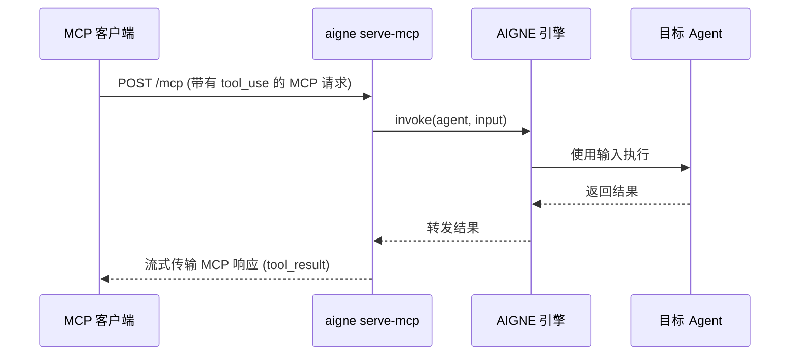

# aigne serve-mcp

`aigne serve-mcp` 命令会启动一个本地服务器，通过模型上下文协议 (MCP) 来暴露你的 AIGNE Agent。这使得与 MCP 兼容的外部系统和应用程序能够像与工具交互一样与你的 Agent 进行交互。

这对于将你的 Agent 集成到更大的工作流中，或以标准化的方式使其可用于其他服务非常有用。

## 基本用法

要使用默认设置启动服务器，请导航到你的项目目录并运行：

```bash
# 在默认端口 3000 上启动 MCP 服务器
aigne serve-mcp
```

该命令会扫描当前目录以查找 AIGNE 项目，加载已配置的 Agent，并启动一个 HTTP 服务器。默认情况下，服务器运行在 `http://localhost:3000/mcp`。


## 工作原理

该命令会初始化一个 MCP 服务器，并从你的 AIGNE 项目中动态地将每个指定的 Agent 注册为一个可调用的“工具”。当请求进入时，服务器会使用提供的输入调用相应的 Agent，并将输出以流式方式返回给客户端。



## 选项

你可以使用以下选项自定义服务器的行为：

| 选项 | 别名 | 描述 | 类型 | 默认值 |
|---|---|---|---|---|
| `--path` | `--url` | Agent 目录的路径或 AIGNE 项目的 URL。 | `string` | `.` |
| `--host` | | 运行 MCP 服务器的主机。使用 `0.0.0.0` 可将服务器公开。 | `string` | `localhost` |
| `--port` | | 运行 MCP 服务器的端口。如果未设置，则使用 `PORT` 环境变量或默认为 3000。 | `number` | `3000` |
| `--pathname` | | MCP 服务端点的特定 URL 路径。 | `string` | `/mcp` |
| `--aigne-hub-url` | | 自定义 AIGNE Hub 服务 URL。用于获取远程 Agent 定义或模型。 | `string` | 不适用 |

## 示例

### 在不同端口上运行

为避免端口冲突，你可以指定一个不同的端口。

```bash
# 在端口 8080 上启动 MCP 服务器
aigne serve-mcp --port 8080
```

### 从特定目录提供 Agent

如果你的终端当前工作目录不是项目根目录，你必须指定 Agent 的路径。

```bash
# 为指定路径下的 Agent 启动 MCP 服务器
aigne serve-mcp --path ./my-agents-project
```

### 将服务器暴露到网络

要允许网络上的其他设备访问 MCP 服务器，请将主机设置为 `0.0.0.0`。

```bash
# 服务器将通过你机器的 IP 地址访问
aigne serve-mcp --host 0.0.0.0 --port 3001
```

### 更改服务路径名

对于反向代理配置或为避免冲突，你可以更改 URL 路径。

```bash
# 服务器将在 http://localhost:3000/api/agents 上可用
aigne serve-mcp --pathname /api/agents
```

## 项目配置

要控制哪些 Agent 通过 MCP 服务器暴露，你需要在 `aigne.yaml` 文件中添加一个 `mcpServer` 部分。在 `agents` 键下列出你想要提供的 Agent 的名称。

```yaml
# aigne.yaml

name: my-project
description: 一个通过 MCP 暴露 Agent 的项目。

agents:
  - id: myAgent1
    # ... Agent 配置

  - id: myAgent2
    # ... Agent 配置

# 通过 MCP 服务器暴露特定的 Agent
mcpServer:
  agents:
    - myAgent1
```

在此示例中，只有 `myAgent1` 将作为工具在 MCP 服务器上可用。如果省略 `mcpServer` 部分，服务器可能会尝试加载所有可用的 Agent。

---

设置好 MCP 服务器后，你可能想了解更多关于定义 Agent 本身的信息。请前往 [Agent 和技能](./core-concepts-agents-and-skills.md) 部分了解更多详情。