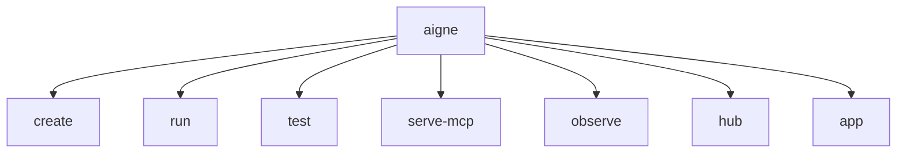

# Command Reference

This section provides a detailed reference for all available `@aigne/cli` commands. The CLI is your primary tool for creating, running, testing, and managing AIGNE projects. Each command is documented on its own page with comprehensive examples and parameter descriptions.

## Command Overview

The following diagram illustrates the main commands available in the AIGNE CLI:

Here is a summary of the primary commands. Select a command to view its detailed documentation, including all available options and usage examples.

| Command                                        | Description                                                                                                   | Preview |
| ---------------------------------------------- | ------------------------------------------------------------------------------------------------------------- | ------- |
| [`aigne create`](./command-reference-create.md)       | Scaffolds a new AIGNE project from a template.                                                                |  |
| [`aigne run`](./command-reference-run.md)             | Executes an agent locally or from a remote URL, with options for chat mode, model selection, and input handling. |  |
| [`aigne serve-mcp`](./command-reference-serve-mcp.md) | Serves agents as a Model Context Protocol (MCP) server for integration with external systems.                 |  |
| [`aigne hub`](./command-reference-hub.md)             | Manages connections to the AIGNE Hub for account management and model access.                                 |         |
| [`aigne observe`](./command-reference-observe.md)     | Starts a local server to view and analyze agent execution traces and observability data.                      |  |
| [`aigne test`](./command-reference-test.md)           | Runs automated tests for your agents and skills.                                                              |         |
| [`aigne app`](./command-reference-built-in-apps.md)   | Executes pre-packaged applications like `doc-smith` for specialized tasks.                                    |         |

## Global Options

These options can be used with any command:

| Option      | Alias | Description                                  |
| ----------- | ----- | -------------------------------------------- |
| `--help`    | `-h`  | Display help information for a command.      |
| `--version` | `-v`  | Display the current version of `@aigne/cli`. |

---

For practical, task-oriented examples of how to combine these commands in your development workflow, please see the [Guides](./guides.md) section.