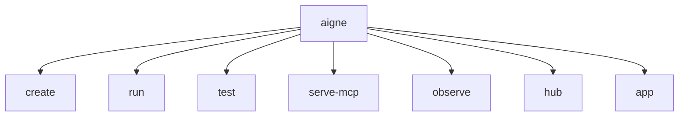

# Command Reference

The `@aigne/cli` provides a comprehensive set of commands to manage the entire lifecycle of your agent development, from project creation to deployment and monitoring. This page serves as a quick reference for all available commands. Select a command to view its detailed documentation, including all options and usage examples.

## Command Structure

The following diagram illustrates the primary commands available at the top level of the AIGNE CLI.

## Available Commands

The following table provides a summary of the main commands. For a complete list of options and arguments for each, please refer to their dedicated pages.

| Command | Description | More Info |
|---|---|---|
| `create` | Scaffolds a new AIGNE project from a template, setting up the necessary file structure and configuration. | [Details](./command-reference-create.md) |
| `run` | Executes an agent locally or from a remote URL. Ideal for testing and interactive chat sessions. | [Details](./command-reference-run.md) |
| `serve-mcp` | Serves one or more agents as a Model Context Protocol (MCP) server for integration with external systems. | [Details](./command-reference-serve-mcp.md) |
| `hub` | Manages connections to the AIGNE Hub, allowing you to switch accounts, check status, and use Hub-provided models. | [Details](./command-reference-hub.md) |
| `observe` | Starts a local observability server to view and analyze agent execution traces and data. | [Details](./command-reference-observe.md) |
| `test` | Runs automated unit and integration tests for your agents and skills. | [Details](./command-reference-test.md) |
| `app` | Provides access to pre-packaged applications, such as `doc-smith`, for specialized tasks. | [Details](./command-reference-built-in-apps.md) |

## Global Options

These options can be used with the base `aigne` command.

- `--help`, `-h`: Displays a summary of all available commands and global options.
- `--version`, `-v`: Shows the installed version of `@aigne/cli`.

---

Now that you have an overview of the available commands, you can dive into the specifics of each one. For practical, task-oriented examples, check out the [Guides](./guides.md) section.