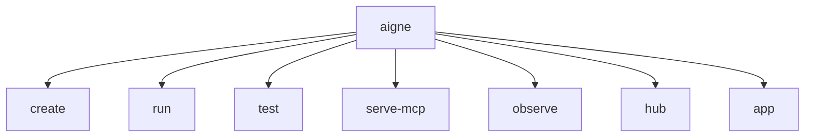

# 命令参考

`@aigne/cli` 提供了一套全面的命令，用于管理 Agent 开发的整个生命周期，从项目创建到部署和监控。本页面是所有可用命令的快速参考。选择一个命令即可查看其详细文档，包括所有选项和使用示例。

## 命令结构

下图展示了 AIGNE CLI 顶层可用的主要命令。

## 可用命令

下表概述了主要命令。如需查看每个命令的完整选项和参数列表，请参阅其专属页面。

| 命令 | 描述 | 更多信息 |
|---|---|---|
| `create` | 从模板搭建一个新的 AIGNE 项目，设置必要的文件结构和配置。 | [详情](./command-reference-create.md) |
| `run` | 在本地或从远程 URL 执行 Agent。是测试和交互式聊天会话的理想选择。 | [详情](./command-reference-run.md) |
| `serve-mcp` | 将一个或多个 Agent 作为模型上下文协议 (MCP) 服务器，以便与外部系统集成。 | [详情](./command-reference-serve-mcp.md) |
| `hub` | 管理与 AIGNE Hub 的连接，允许您切换账户、检查状态以及使用 Hub 提供的模型。 | [详情](./command-reference-hub.md) |
| `observe` | 启动本地可观测性服务器，以查看和分析 Agent 的执行轨迹和数据。 | [详情](./command-reference-observe.md) |
| `test` | 为您的 Agent 和技能运行自动化单元测试和集成测试。 | [详情](./command-reference-test.md) |
| `app` | 提供对预打包应用程序（如 `doc-smith`）的访问，以执行专门任务。 | [详情](./command-reference-built-in-apps.md) |

## 全局选项

这些选项可与 `aigne` 基础命令一起使用。

- `--help`, `-h`: 显示所有可用命令和全局选项的摘要。
- `--version`, `-v`: 显示已安装的 `@aigne/cli` 版本。

---

现在您已经对可用命令有了大致了解，可以深入研究每个命令的具体细节。如需查看面向任务的实际示例，请参阅 [指南](./guides.md) 部分。