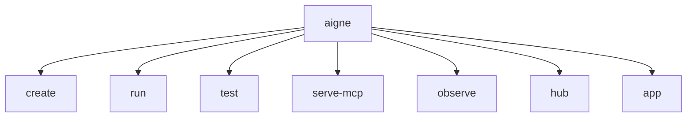

# 命令参考

本节提供了所有可用的 @aigne/cli 命令及其选项的详细参考。CLI 是您用于创建、运行、测试和部署 AIGNE Agent 的主要工具。每个命令都在其各自的页面上进行了详细记录，并附有全面的示例和参数说明。

## 命令概述

下图展示了 AIGNE CLI 中可用的主要命令：

以下是主要命令的摘要。选择一个命令以查看其详细文档，包括所有可用的选项和使用示例。

| Command                                             | Description                                                                                                   |
| --------------------------------------------------- | ------------------------------------------------------------------------------------------------------------- |
| [`aigne create`](./command-reference-create.md)         | 从模板搭建一个新的 AIGNE 项目。                                                                               |
| [`aigne run`](./command-reference-run.md)               | 在本地或从远程 URL 执行一个 Agent，并提供聊天模式、模型选择和输入处理等选项。                                     |
| [`aigne serve-mcp`](./command-reference-serve-mcp.md)   | 将 Agent 作为模型上下文协议 (MCP) 服务器提供服务，以便与外部系统集成。                                          |
| [`aigne hub`](./command-reference-hub.md)               | 管理与 AIGNE Hub 的连接，允许您切换账户、检查状态以及使用 Hub 提供的模型。                                        |
| [`aigne observe`](./command-reference-observe.md)       | 启动一个本地服务器，用于查看和分析 Agent 执行跟踪和可观测性数据。                                                 |
| [`aigne test`](./command-reference-test.md)             | 为您的 Agent 和技能运行自动化测试。                                                                             |
| [`aigne app`](./command-reference-built-in-apps.md)     | 执行像 `doc-smith` 这样的预打包应用程序以完成专门任务。                                                         |

## 全局选项

这些选项可用于任何命令：

| Option          | Alias | Description                                  |
| --------------- | ----- | -------------------------------------------- |
| `--help`        | `-h`  | 显示命令的帮助信息。                         |
| `--version`     | `-v`  | 显示 @aigne/cli 的当前版本。                 |

---

有关如何在您的开发工作流程中结合使用这些命令的实用、面向任务的示例，请参阅 [指南](./guides.md) 部分。