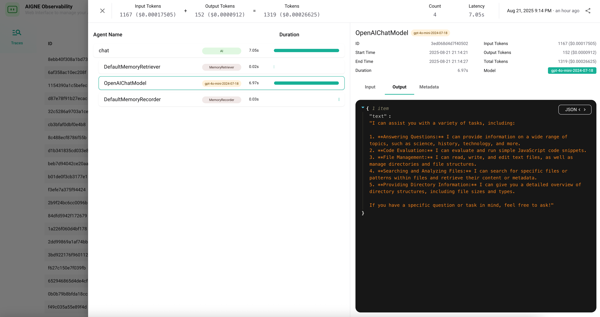

# 命令参考

本节提供了所有可用 `@aigne/cli` 命令的详细参考。CLI 是您创建、运行、测试和管理 AIGNE 项目的主要工具。每个命令都在其各自的页面上进行了详细记录，并附有全面的示例和参数说明。

## 命令概述

下图展示了 AIGNE CLI 中可用的主要命令：

以下是主要命令的摘要。选择一个命令以查看其详细文档，包括所有可用选项和使用示例。

| 命令 | 描述 | 预览 |
| --- | --- | --- |
| [`aigne create`](./command-reference-create.md) | 从模板创建一个新的 AIGNE 项目。 |  |
| [`aigne run`](./command-reference-run.md) | 在本地或从远程 URL 执行 agent，并提供聊天模式、模型选择和输入处理等选项。 |  |
| [`aigne serve-mcp`](./command-reference-serve-mcp.md) | 将 agents 作为模型上下文协议 (MCP) 服务器提供服务，以便与外部系统集成。 |  |
| [`aigne hub`](./command-reference-hub.md) | 管理与 AIGNE Hub 的连接，用于账户管理和模型访问。 |  |
| [`aigne observe`](./command-reference-observe.md) | 启动本地服务器以查看和分析 agent 执行跟踪和可观察性数据。 |  |
| [`aigne test`](./command-reference-test.md) | 为您的 agents 和技能运行自动化测试。 |  |
| [`aigne app`](./command-reference-built-in-apps.md) | 执行像 `doc-smith` 这样的预打包应用程序以完成专门任务。 |  |

## 全局选项

这些选项可用于任何命令：

| 选项 | 别名 | 描述 |
| --- | --- | --- |
| `--help` | `-h` | 显示命令的帮助信息。 |
| `--version` | `-v` | 显示 `@aigne/cli` 的当前版本。 |

---

有关如何在开发工作流程中结合使用这些命令的实用、面向任务的示例，请参阅 [指南](./guides.md) 部分。