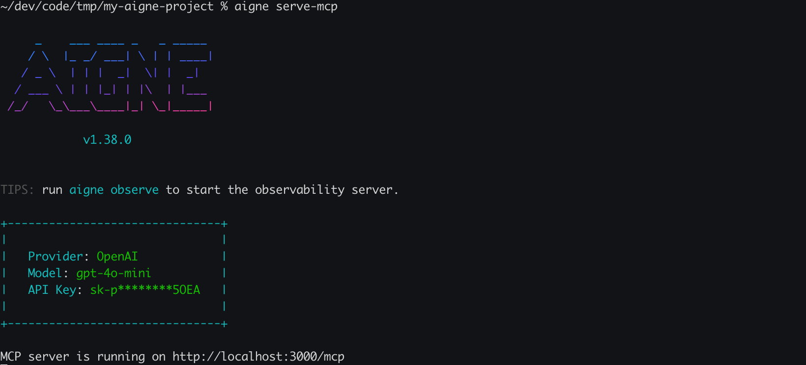

# Agents and Skills

In an AIGNE project, Agents and Skills are the fundamental executable components. An Agent is the primary entity that receives input and orchestrates work, while a Skill is a specific, reusable function that an Agent can call to accomplish its goals. Both are defined within your project—typically in `.yaml` files for agents and `.js` files for skills—and are referenced in the main project configuration. For more details on the project structure, see [Project Configuration (aigne.yaml)](./core-concepts-project-configuration.md).

```d2
direction: down

agent: {
  label: "Agent\n(e.g., Chatbot)"
  shape: person
}

code-evaluator: {
  label: "Skill\n(Code Evaluator)"
  shape: hexagon
}

api-connector: {
  label: "Skill\n(API Connector)"
  shape: hexagon
}

agent -> code-evaluator: uses
agent -> api-connector: uses
```

## Agents

An agent is a component designed to achieve a goal. It is guided by a set of instructions and can leverage a collection of skills to interact with users, data, or external systems.

### Standard Agent Definition

A standard agent is defined in a YAML file. Here is an example of a simple chat agent:

```yaml
name: chat
description: Chat agent
instructions: |
  You are a helpful assistant that can answer questions and provide information on a wide range of topics.
  Your goal is to assist users in finding the information they need and to engage in friendly conversation.
input_key: message
memory: true
skills:
  - sandbox.js
```

**Agent Properties**

| Property       | Type      | Description                                                                                             |
|----------------|-----------|---------------------------------------------------------------------------------------------------------|
| `name`         | `string`  | A short, descriptive name for the agent.                                                                |
| `description`  | `string`  | A brief summary of what the agent does.                                                                 |
| `instructions` | `string`  | The system prompt or core instructions that guide the agent's behavior and responses.                   |
| `input_key`    | `string`  | The key used for user input when running the agent.                                                     |
| `memory`       | `boolean` | If `true`, the agent will maintain a memory of the conversation history.                                  |
| `skills`       | `array`   | A list of skill files (e.g., `sandbox.js`) that this agent is equipped to use.                          |

### MCP Agents

Besides standard agents, AIGNE supports agents that conform to the Model Context Protocol (MCP). These are typically external tools or services wrapped as agents. They are defined with a `type` of `mcp` and specify a command to execute.

```yaml
type: mcp
command: npx
args: ["-y", "@modelcontextprotocol/server-filesystem", "."]
```

This allows AIGNE to integrate with a broader ecosystem of compatible tools.



## Skills

A skill is a JavaScript module that exports a function, enabling an agent to perform specific, programmatic actions like calculations, data lookups, or API calls.

### Skill Definition

Skills are defined with a clear contract, including a description and schemas for inputs and outputs. This structured approach allows the agent's underlying model to understand how and when to use the skill.

Here is an example of a `sandbox.js` skill that evaluates JavaScript code:

```javascript
import vm from "node:vm";

export default async function evaluateJs({ code }) {
  const sandbox = {};
  const context = vm.createContext(sandbox);
  const result = vm.runInContext(code, context, { displayErrors: true });
  return { result };
}

evaluateJs.description = "This agent evaluates JavaScript code.";

evaluateJs.input_schema = {
  type: "object",
  properties: {
    code: { type: "string", description: "JavaScript code to evaluate" },
  },
  required: ["code"],
};

evaluateJs.output_schema = {
  type: "object",
  properties: {
    result: { type: "any", description: "Result of the evaluated code" },
  },
  required: ["result"],
};
```

**Key Components of a Skill**

*   **Default Export**: The file must export a function as its default export. This function contains the core logic of the skill.
*   **`description`**: A string property attached to the function. It provides a natural language description of what the skill does. The agent's LLM uses this to determine when to call the function.
*   **`input_schema`**: A JSON Schema object that defines the function's parameters. This ensures the agent calls the skill with correctly formatted data.
*   **`output_schema`**: A JSON Schema object that defines the structure of the function's return value. This helps the agent understand the result of the skill execution.

## How They Work Together

When a user interacts with an agent, the AIGNE engine combines the user's input, the agent's instructions, and the descriptions of its available skills into a prompt for the LLM. The LLM then decides whether to respond directly or to use a skill to gather more information or perform an action.

For example, a user might ask the chat agent to perform a calculation. The agent, equipped with the `sandbox.js` skill, can evaluate the code and return the result.


The underlying process follows a clear sequence:

```d2
shape: sequence_diagram

User: User
AIGNE-Engine: "AIGNE Engine"
LLM: LLM
Sandbox-Skill: "sandbox.js Skill"

User -> AIGNE-Engine: "What is 5 * 12?"
AIGNE-Engine -> LLM: "1. Prompt with skills"
LLM --> AIGNE-Engine: "2. Decide to call skill"
AIGNE-Engine -> Sandbox-Skill: "3. Execute `evaluateJs`"
Sandbox-Skill --> AIGNE-Engine: "4. Return `{ result: 60 }`"
AIGNE-Engine -> LLM: "5. Send skill result"
LLM --> AIGNE-Engine: "6. Formulate response"
AIGNE-Engine -> User: "7. Respond to user"
```

This flow allows agents to perform complex, multi-step tasks by breaking them down and delegating specific actions to specialized skills. You can inspect the details of these interactions, including the exact inputs and outputs of each skill call, using the observability tools.


---

Now that you understand the core concepts of Agents and Skills, you can learn how to execute them using the CLI. For a detailed guide on running your agents, see the [aigne run command reference](./command-reference-run.md). To build your own, follow the [Creating a Custom Agent guide](./guides-creating-a-custom-agent.md).