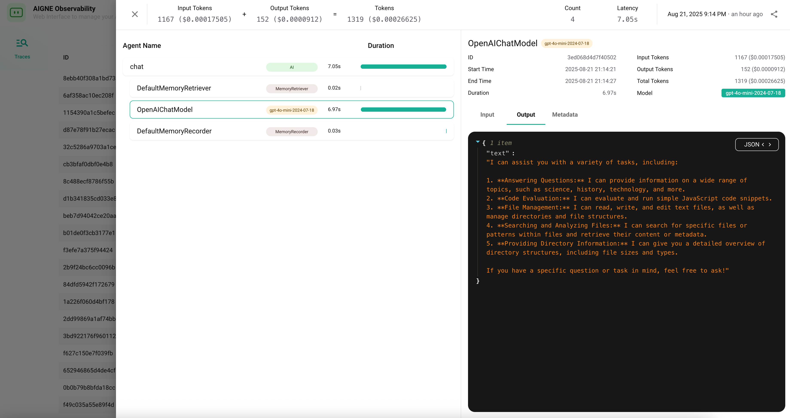

# Agent 和 Skill

在 AIGNE 项目中，Agent 和 Skill 是最基本的可执行组件。Agent 是接收输入并协调工作的主要实体，而 Skill 是 Agent 为实现其目标而可以调用的特定、可复用的函数。两者都在项目内部进行定义——Agent 通常在 `.yaml` 文件中定义，Skill 通常在 `.js` 文件中定义——并在主项目配置中被引用。有关项目结构的更多详细信息，请参阅[项目配置 (aigne.yaml)](./core-concepts-project-configuration.md)。

```d2
direction: down

agent: "Agent (例如，聊天机器人)" {
  shape: person
}

skill1: "Skill (例如，代码评估器)" {
  shape: hexagon
}

skill2: "Skill (例如，API 连接器)" {
  shape: hexagon
}

agent -> skill1: uses
agent -> skill2: uses
```

## Agent

Agent 是为实现特定目标而设计的组件。它在一组指令的引导下运行，并可利用一系列 Skill 与用户、数据或外部系统进行交互。

### 标准 Agent 定义

标准 Agent 在 YAML 文件中定义。以下是一个简单的聊天 Agent 示例：

```yaml
name: chat
description: 聊天 Agent
instructions: |
  你是一个乐于助人的助手，可以回答问题并提供关于各种主题的信息。
  你的目标是帮助用户找到他们需要的信息，并进行友好的交谈。
input_key: message
memory: true
skills:
  - sandbox.js
```

**Agent 属性**

| Property       | Type      | Description                                                                                             |
|----------------|-----------|---------------------------------------------------------------------------------------------------------|
| `name`         | `string`  | Agent 的简短描述性名称。                                                                                |
| `description`  | `string`  | 关于 Agent 功能的简要总结。                                                                             |
| `instructions` | `string`  | 用于指导 Agent 行为和响应的系统提示或核心指令。                                                         |
| `input_key`    | `string`  | 运行 Agent 时用于用户输入的键。                                                                         |
| `memory`       | `boolean` | 如果为 `true`，Agent 将保留对话历史的记忆。                                                             |
| `skills`       | `array`   | 此 Agent 可使用的 Skill 文件列表（例如 `sandbox.js`）。                                                 |

### MCP Agent

除了标准 Agent，AIGNE 还支持符合模型上下文协议 (Model Context Protocol, MCP) 的 Agent。这些通常是封装为 Agent 的外部工具或服务。它们通过将 `type` 设置为 `mcp` 来定义，并指定一个要执行的命令。

```yaml
type: mcp
command: npx
args: ["-y", "@modelcontextprotocol/server-filesystem", "."]
```

这使得 AIGNE 能够与更广泛的兼容工具生态系统集成。


## Skill

Skill 是一个导出函数的 JavaScript 模块，使 Agent 能够执行特定的程序化操作，如计算、数据查找或 API 调用。

### Skill 定义

Skill 通过明确的契约进行定义，包括描述以及输入和输出的结构。这种结构化的方法使得 Agent 的底层模型能够理解如何以及何时使用该 Skill。

以下是一个用于评估 JavaScript 代码的 `sandbox.js` Skill 示例：

```javascript
import vm from "node:vm";

export default async function evaluateJs({ code }) {
  const sandbox = {};
  const context = vm.createContext(sandbox);
  const result = vm.runInContext(code, context, { displayErrors: true });
  return { result };
}

evaluateJs.description = "此 Agent 评估 JavaScript 代码。";

evaluateJs.input_schema = {
  type: "object",
  properties: {
    code: { type: "string", description: "要评估的 JavaScript 代码" },
  },
  required: ["code"],
};

evaluateJs.output_schema = {
  type: "object",
  properties: {
    result: { type: "any", description: "评估代码的结果" },
  },
  required: ["result"],
};
```

**Skill 的关键组件**

*   **默认导出 (Default Export)**：文件必须导出一个函数作为其默认导出。该函数包含 Skill 的核心逻辑。
*   **`description`**：附加到函数上的字符串属性。它提供了关于 Skill 功能的自然语言描述。Agent 的 LLM 使用此描述来决定何时调用该函数。
*   **`input_schema`**：一个用于定义函数参数的 JSON Schema 对象。这确保了 Agent 在调用 Skill 时使用格式正确的数据。
*   **`output_schema`**：一个用于定义函数返回值的结构的 JSON Schema 对象。这有助于 Agent 理解 Skill 执行的结果。

## 它们如何协同工作

当用户与 Agent 交互时，AIGNE 引擎会将用户的输入、Agent 的指令及其可用 Skill 的描述组合成一个提示 (prompt) 发送给 LLM。然后，LLM 决定是直接响应，还是使用 Skill 来收集更多信息或执行操作。

例如，用户可能会要求聊天 Agent 执行计算。配备了 `sandbox.js` Skill 的 Agent 可以评估代码并返回结果。


其底层流程遵循一个清晰的序列：

```d2
shape: sequence_diagram

User: "用户"
Agent: "AIGNE 引擎"
LLM: "LLM"
Skill: "sandbox.js"

User -> Agent: "5 * 12 是多少？"
Agent -> LLM: "处理包含指令和 Skill 描述的提示"
LLM --> Agent: "决定使用代码 '5 * 12' 调用 'sandbox.js'"
Agent -> Skill: "evaluateJs({ code: '5 * 12' })"
Skill --> Agent: "返回 { result: 60 }"
Agent -> LLM: "提供 Skill 执行结果"
LLM --> Agent: "构建最终响应"
Agent --> User: "结果是 60。"
```

这个流程允许 Agent 通过分解任务并将具体操作委托给专门的 Skill 来执行复杂的多步骤任务。你可以使用可观测性工具来检查这些交互的详细信息，包括每次 Skill 调用的确切输入和输出。



---

现在你已经了解了 Agent 和 Skill 的核心概念，接下来可以学习如何使用 CLI 来执行它们。有关运行 Agent 的详细指南，请参阅 [aigne run 命令参考](./command-reference-run.md)。要构建自己的 Agent，请遵循[创建自定义 Agent 指南](./guides-creating-a-custom-agent.md)。