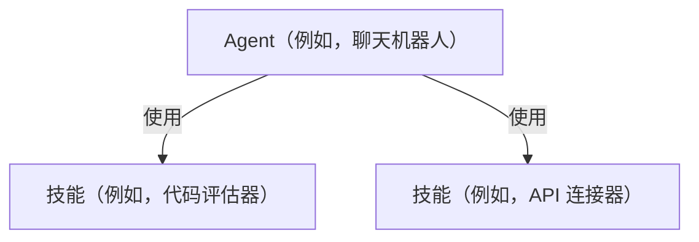
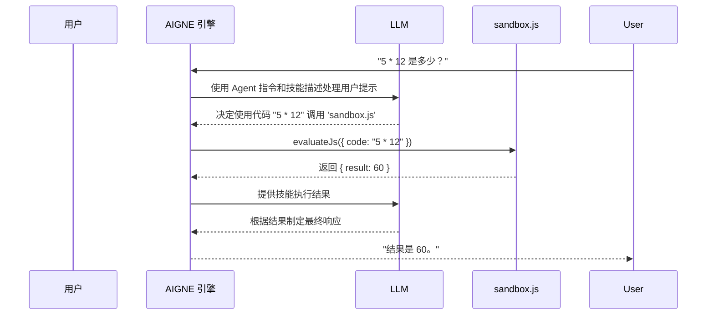

# Agent 和技能

在一个 AIGNE 项目中，Agent 和技能是基本的可执行组件。Agent 是接收输入和协调工作的主要实体，而技能是 Agent 为实现其目标可以调用的一个特定的、可重用的函数。两者都在您的项目中定义——通常 Agent 在 .yaml 文件中定义，技能在 .js 文件中定义——并在主项目配置中被引用。有关项目结构的更多详细信息，请参阅[项目配置 (aigne.yaml)](./core-concepts-project-configuration.md)。



## Agent

Agent 是一个为实现特定目标而设计的组件。它由一组指令引导，并可以利用一系列技能与用户、数据或外部系统进行交互。

### 标准 Agent 定义

标准 Agent 在 YAML 文件中定义。以下是一个简单的聊天 Agent 示例：

```yaml
name: chat
description: Chat agent
instructions: |
  You are a helpful assistant that can answer questions and provide information on a wide range of topics.
  Your goal is to assist users in finding the information they need and to engage in friendly conversation.
input_key: message
memory: true
skills:
  - sandbox.js
```

**Agent 属性**

| 属性 | 类型 | 描述 |
|---|---|---|
| `name` | `string` | 一个简短的、描述性的 Agent 名称。 |
| `description` | `string` | 关于 Agent 功能的简要总结。 |
| `instructions` | `string` | 指导 Agent 行为和响应的系统提示或核心指令。 |
| `input_key` | `string` | 运行 Agent 时用于用户输入的键。 |
| `memory` | `boolean` | 如果为 `true`，Agent 将保留对话历史的记忆。 |
| `skills` | `array` | 此 Agent 配备使用的技能文件列表（例如 `sandbox.js`）。 |

### MCP Agent

除了标准 Agent，AIGNE 还支持符合模型上下文协议 (MCP) 的 Agent。这些通常是包装为 Agent 的外部工具或服务。它们通过将 `type` 设置为 `mcp` 来定义，并指定一个要执行的命令。

```yaml
type: mcp
command: npx
args: ["-y", "@modelcontextprotocol/server-filesystem", "."]
```

这使得 AIGNE 能够与更广泛的兼容工具生态系统集成。


## 技能

技能是一个导出函数的 JavaScript 模块，使 Agent 能够执行特定的编程操作，如计算、数据查找或 API 调用。

### 技能定义

技能通过清晰的契约进行定义，包括描述以及用于输入和输出的结构。这种结构化的方法使得 Agent 的底层模型能够理解如何以及何时使用该技能。

以下是一个评估 JavaScript 代码的 `sandbox.js` 技能示例：

```javascript
import vm from "node:vm";

export default async function evaluateJs({ code }) {
  const sandbox = {};
  const context = vm.createContext(sandbox);
  const result = vm.runInContext(code, context, { displayErrors: true });
  return { result };
}

evaluateJs.description = "此 Agent 用于评估 JavaScript 代码。";

evaluateJs.input_schema = {
  type: "object",
  properties: {
    code: { type: "string", description: "要评估的 JavaScript 代码" },
  },
  required: ["code"],
};

evaluateJs.output_schema = {
  type: "object",
  properties: {
    result: { type: "any", description: "评估代码的结果" },
  },
  required: ["result"],
};
```

**技能的关键组件**

*   **默认导出**：文件必须导出一个函数作为其默认导出。该函数包含技能的核心逻辑。
*   **`description`**：附加到函数上的字符串属性。它提供了关于技能功能的自然语言描述。Agent 的 LLM 使用此描述来决定何时调用该函数。
*   **`input_schema`**：一个定义函数参数的 JSON Schema 对象。这确保了 Agent 使用格式正确的数据调用技能。
*   **`output_schema`**：一个定义函数返回值的结构的 JSON Schema 对象。这有助于 Agent 理解技能执行的结果。

## 它们如何协同工作

当用户与 Agent 交互时，AIGNE 引擎会将用户的输入、Agent 的指令及其可用技能的描述组合成一个提示，发送给 LLM。然后，LLM 决定是直接响应，还是使用技能来收集更多信息或执行操作。

例如，用户可能会要求聊天 Agent 执行计算。配备了 `sandbox.js` 技能的 Agent 可以评估代码并返回结果。


其底层过程遵循一个清晰的序列：



这个流程允许 Agent 将复杂的、多步骤的任务分解，并将具体操作委托给专门的技能来执行。您可以使用可观测性工具来检查这些交互的详细信息，包括每次技能调用的确切输入和输出。


---

现在您已经了解了 Agent 和技能的核心概念，可以学习如何使用 CLI 来执行它们。有关运行 Agent 的详细指南，请参阅 [aigne run 命令参考](./command-reference-run.md)。要构建您自己的 Agent，请遵循[创建自定义 Agent 指南](./guides-creating-a-custom-agent.md)。