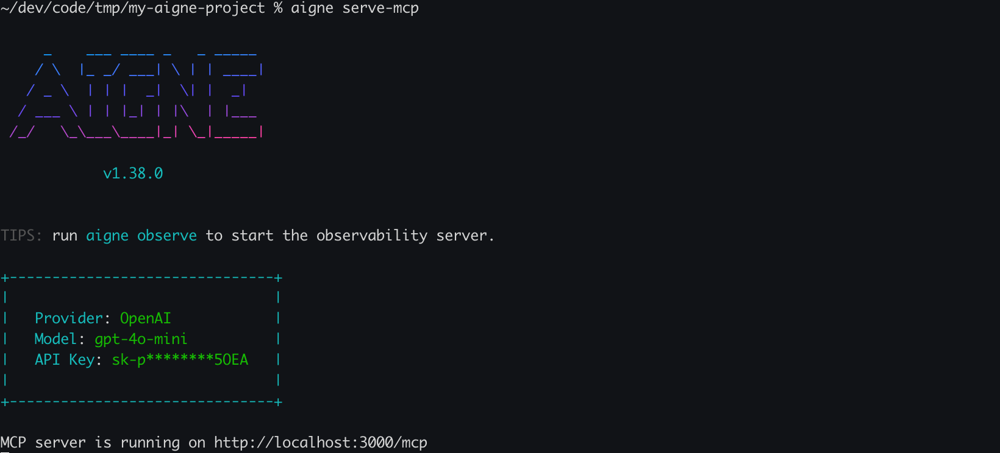
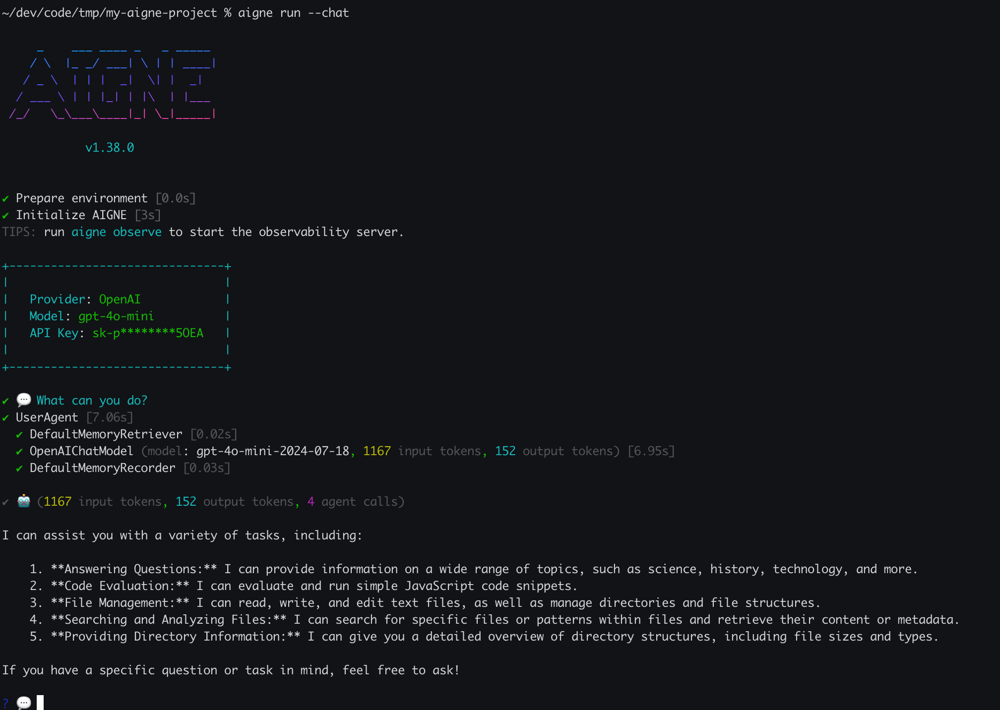

# 项目配置 (aigne.yaml)

`aigne.yaml` 文件是 AIGNE 项目的核心清单文件。它定义了核心组件，包括聊天模型、Agent 和技能，并提供项目级别的元数据。该文件对于 AIGNE CLI 理解如何运行、服务和管理您的 Agent 至关重要。

```d2
direction: down

"aigne.yaml": {
  shape: document
  "项目清单": {
    "元数据": {
      "name": "my-project"
      "description": "..."
    }
    "chat_model": {
      "provider": "openai"
      "name": "gpt-4o-mini"
    }
    "agents": {
      "chat.yaml ->": {
        shape: page
        "系统提示、技能等"
      }
    }
    "skills": {
      "sandbox.js ->": {
        shape: page
        "JavaScript 逻辑"
      }
      "filesystem.yaml ->": {
        shape: page
        "工具定义"
      }
    }
    "mcp_server": "通过 MCP 暴露 Agent"
    "cli": "通过 CLI 暴露 Agent"
  }
}
```

## 关键配置部分

该配置通过几个顶级键进行组织。下面将详细介绍用于定义项目的主要部分。

### 项目元数据

您可以为项目提供可选的元数据，以帮助识别和描述它。

| 键 | 类型 | 描述 |
|---|---|---|
| `name` | String | 项目的唯一名称。 |
| `description` | String | 项目功能的简要描述。 |

**示例：**
```yaml
name: test_aigne_project
description: A test project for the aigne agent
```

### `chat_model`

此部分指定您的 Agent 将用于生成响应的 AI 模型。您可以定义提供商、模型名称以及控制模型行为的参数。

| 键 | 类型 | 描述 |
|---|---|---|
| `provider` | String | 模型提供商的名称，例如 `openai`。 |
| `name` | String | 模型的特定标识符，如 `gpt-4o-mini`。 |
| `model` | String | 提供商和名称的备选组合格式，例如 `openai:gpt-4o-mini`。 |
| `temperature` | Number | 一个介于 0.0 和 2.0 之间的值，用于控制输出的随机性。值越高，响应越具创造性。 |
| `topP` | Number | 控制核心采样。模型只考虑概率质量最高的 P 个 token。 |
| `presencePenalty` | Number | 一个介于 -2.0 和 2.0 之间的值。正值会根据新 token 是否已在文本中出现来进行惩罚，从而增加模型谈论新主题的可能性。 |
| `frequencyPenalty` | Number | 一个介于 -2.0 和 2.0 之间的值。正值会根据新 token 在文本中已有的频率来进行惩罚，从而降低模型逐字重复同一行的可能性。 |

**示例：**
```yaml
chat_model:
  provider: openai
  name: gpt-4o-mini
  temperature: 0.8
```

### `agents`

这是一个 Agent 定义文件列表，是您项目的一部分。每个条目都是一个 YAML 文件的路径，该文件指定了 Agent 的配置，例如其系统提示和可访问的技能。有关定义 Agent 的更多详细信息，请参阅 [Agent 和技能](./core-concepts-agents-and-skills.md) 部分。

**示例：**
```yaml
agents:
  - chat.yaml
```

### `skills`

此列表定义了项目中可供 Agent 使用的技能。技能是可重用的工具或函数，允许 Agent 执行操作，例如访问文件系统或调用外部 API。技能可以在 YAML 中定义，也可以作为 JavaScript 模块定义。

**示例：**
```yaml
skills:
  - sandbox.js
  - filesystem.yaml
```

### 专业化配置

对于更高级的用例，您可以添加部分来控制 Agent 如何通过不同接口暴露。

- **`mcp_server`**：指定运行 `aigne serve-mcp` 时暴露哪些 Agent。这对于将您的 Agent 与支持模型上下文协议的外部系统集成非常有用。
- **`cli`**：定义哪些 Agent 可以使用 `aigne run` 命令直接从命令行运行。

当您配置 `mcp_server` 部分并运行 `aigne serve-mcp` 命令时，指定的 Agent 将通过本地服务器可用，如下所示：



**示例：**
```yaml
mcp_server:
  agents:
    - chat.yaml

cli:
  agents:
    - chat.yaml
```

## 完整示例

以下是两个 `aigne.yaml` 文件的示例，从基本配置到更具体的配置。

### 默认项目配置

这是创建新 AIGNE 项目时生成的标准配置文件。它定义了一个聊天模型、一个默认 Agent 和几个内置技能。

```yaml
chat_model:
  provider: openai
  name: gpt-4o-mini
  temperature: 0.8
agents:
  - chat.yaml
skills:
  - sandbox.js
  - filesystem.yaml
```

使用 `aigne run --chat` 在聊天模式下运行此默认项目中的 Agent 将启动一个交互式会话：



### 包含元数据和服务配置的项目

此示例包含项目元数据（`name`、`description`），并指定了哪些 Agent 可用于 MCP 服务器和 CLI。

```yaml
name: test_aigne_project
description: A test project for the aigne agent
chat_model:
  model: openai:gpt-4o-mini
  temperature: 0.8
agents:
  - chat.yaml
skills:
  - sandbox.js
mcp_server:
  agents:
    - chat.yaml
cli:
  agents:
    - chat.yaml
```

正确配置 `aigne.yaml` 后，您的项目就有了坚实的基础。下一步是定义您的 Agent 和技能的行为与能力。请继续阅读 [Agent 和技能](./core-concepts-agents-and-skills.md) 指南以了解更多信息。