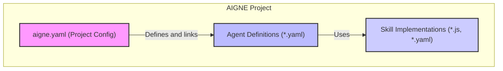

# Core Concepts

To effectively build with AIGNE, it's important to understand the fundamental components that make up a project. This section provides an overview of the project structure and introduces the core concepts of Agents, Skills, and the central configuration file, `aigne.yaml`. These elements work together to create powerful and modular AI applications.

## Project Structure and Configuration

The heart of every AIGNE project is the `aigne.yaml` file. This central manifest is the single source of truth for your project's configuration. It defines essential metadata, specifies the default chat model, and most importantly, registers the agents and skills that are part of the application.

By managing these relationships in one place, `aigne.yaml` provides a clear and organized structure for even complex projects. For a complete breakdown of all available properties and configuration examples, see the [Project Configuration (aigne.yaml)](./core-concepts-project-configuration.md) guide.

## Agents and Skills

Agents and Skills are the primary executable components in an AIGNE project.

### Agents
An **Agent** is an entity designed to perform tasks. It is defined by a set of instructions, can maintain a memory of its interactions, and utilizes one or more Skills to accomplish its goals. Agents are typically defined in their own YAML files (e.g., `chat.yaml`), which specify their behavior and the tools they have access to.

### Skills
A **Skill** is a reusable tool or function that an Agent can call upon. Skills provide specific, encapsulated capabilities, such as running JavaScript code (`sandbox.js`), interacting with a filesystem, or calling an external API. This modular approach allows you to build complex agent behaviors from simple, reusable, and testable components.

To learn how to define and structure these components, refer to the detailed [Agents and Skills](./core-concepts-agents-and-skills.md) documentation.

## Next Steps

With a grasp of these core concepts, you are ready to explore the specifics of project configuration and how to build your own agents and skills. The following sections provide in-depth details for each component:

*   **[Project Configuration (aigne.yaml)](./core-concepts-project-configuration.md)**: Dive into the details of the main project configuration file.
*   **[Agents and Skills](./core-concepts-agents-and-skills.md)**: Learn the specifics of defining and creating agents and skills.