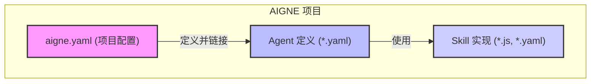

# 核心概念

要高效地使用 AIGNE 进行构建，理解项目的基本组成部分至关重要。本节将介绍核心概念：以 `aigne.yaml` 为基础的项目结构，以及被称为 Agents 和 Skills 的可执行单元。这些元素协同工作，共同创建模块化且功能强大的 AI 应用程序。

## 项目结构和配置

`aigne.yaml` 文件是每个 AIGNE 项目的核心清单。它作为配置的唯一真实来源，用于定义项目元数据、指定默认聊天模型以及注册所有 Agent 和 Skill。通过在一个地方管理这些关系，`aigne.yaml` 为复杂项目提供了清晰且有组织的结构。

有关所有可用属性和配置选项的完整说明，请参阅 [项目配置 (aigne.yaml)](./core-concepts-project-configuration.md) 文档。

## Agent 和 Skill

Agent 和 Skill 是 AIGNE 项目中的主要可执行组件。它们代表了 AI 应用程序的逻辑和功能。

### Agent
**Agent** 是一个旨在执行任务的实体。它由一组指令定义，可以维护其交互的记忆，并利用一个或多个 Skill 来实现其目标。Agent 通常在它们自己的 YAML 文件（例如 `chat.yaml`）中定义，这些文件指定了它们的行为和可以访问的工具。

### Skill
**Skill** 是 Agent 可以调用的可重用工具或函数。Skill 提供特定的、封装的功能，例如执行 JavaScript 代码（`sandbox.js`）或与文件系统交互。这种模块化的方法允许你从简单、可重用和可测试的组件中组合出复杂的 Agent 行为。

以下是默认 `chat` Agent 运行的示例，它使用其 Skill 来响应用户输入：

要了解如何定义和构建这些组件，请参阅详细的 [Agent 和 Skill](./core-concepts-agents-and-skills.md) 指南。

## 后续步骤

掌握了这些核心概念后，你就可以开始探索项目配置的具体细节以及如何构建自己的 Agent 和 Skill。以下各节提供了每个组件的深入详细信息：

- **[项目配置 (aigne.yaml)](./core-concepts-project-configuration.md)**：深入了解主项目配置文件的详细信息。
- **[Agent 和 Skill](./core-concepts-agents-and-skills.md)**：学习定义和创建 Agent 与 Skill 的具体细节。
