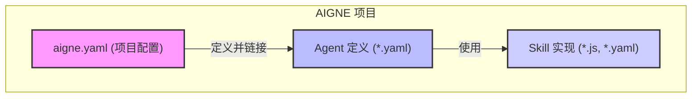

# 核心概念

为了有效地使用 AIGNE 进行构建，理解构成项目的基本组件至关重要。本节概述了项目结构，并介绍了 Agents、Skills 以及核心配置文件 `aigne.yaml` 的核心概念。这些元素协同工作，共同创建出功能强大且模块化的 AI 应用程序。

## 项目结构与配置

每个 AIGNE 项目的核心都是 `aigne.yaml` 文件。这个中央清单是项目配置的唯一真实来源。它定义了基本元数据，指定了默认聊天模型，最重要的是，注册了作为应用程序一部分的 agents 和 skills。

通过在单一位置管理这些关系，`aigne.yaml` 为复杂的项目也提供了清晰且有条理的结构。要完整了解所有可用属性和配置示例，请参阅[项目配置 (aigne.yaml)](./core-concepts-project-configuration.md) 指南。

## Agents 和 Skills

Agents 和 Skills 是 AIGNE 项目中的主要可执行组件。

### Agents
**Agent** 是一个旨在执行任务的实体。它由一组指令定义，能够保留交互记忆，并利用一个或多个 Skills 来实现其目标。Agents 通常在各自的 YAML 文件（例如 `chat.yaml`）中定义，用以指定其行为和可供使用的工具。

### Skills
**Skill** 是 **Agent** 可以调用的可重用工具或函数。Skills 提供特定的封装功能，例如运行 JavaScript 代码 (`sandbox.js`)、与文件系统交互或调用外部 API。这种模块化的方法使您能够通过简单、可重用且可测试的组件来构建复杂的 agent 行为。

要了解如何定义和组织这些组件，请参阅详细的 [Agents 和 Skills](./core-concepts-agents-and-skills.md) 文档。

## 后续步骤

掌握了这些核心概念后，您就可以开始探索项目配置的具体细节，并学习如何构建自己的 agents 和 skills。以下各节为每个组件提供了深入的详细信息：

*   **[项目配置 (aigne.yaml)](./core-concepts-project-configuration.md)**: 深入了解主项目配置文件的详细信息。
*   **[Agents 和 Skills](./core-concepts-agents-and-skills.md)**: 了解定义和创建 agents 和 skills 的具体方法。