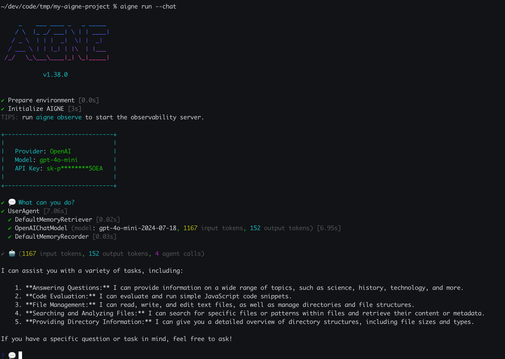

# 创建自定义 Agent

本指南提供了一个分步教程，介绍如何使用 JavaScript 创建一个新的 agent，并将其作为可重用技能集成到您的 AIGNE 项目中。技能是可以由更高级别的 agents 编排以执行特定任务的基本、可执行组件。

阅读本指南后，您将学习如何：
- 编写一个充当技能的 JavaScript 函数。
- 使用标准的 JSON 模式为其输入和输出定义接口。
- 在您的项目配置中注册新技能。
- 直接测试技能并在一个更大的 agent 中使用它。

---

## 步骤 1：创建 JavaScript 技能文件

首先，为您的 agent 创建一个新的 JavaScript 文件。一种常见的做法是将自定义技能组织在一个专用目录中，例如 `skills/`。我们将创建一个简单的 agent，用于将两个数字相加。

在您项目内的 `skills/` 目录中创建一个名为 `calculator.js` 的文件：

```javascript
// skills/calculator.js
export default async function calculator({ a, b }) {
  const result = a + b;
  return { result };
}
```

该文件导出一个默认的异步函数。该函数接受一个包含 `a` 和 `b` 属性的对象，并返回一个包含 `result` 属性的对象，该属性的值是它们的和。

## 步骤 2：定义元数据和模式

为了让 AIGNE 引擎理解如何使用您的技能，您必须为函数附加元数据。这包括 `description`、`input_schema` 和 `output_schema`。

修改您的 `calculator.js` 文件以包含这些属性：

```javascript
// skills/calculator.js
export default async function calculator({ a, b }) {
  const result = a + b;
  return { result };
}

// 对技能作用的人类可读描述。
calculator.description = "This skill calculates the sum of two numbers.";

// 使用 JSON 模式定义预期的输入结构。
calculator.input_schema = {
  type: "object",
  properties: {
    a: { type: "number", description: "The first number" },
    b: { type: "number", description: "The second number" },
  },
  required: ["a", "b"],
};

// 使用 JSON 模式定义预期的输出结构。
calculator.output_schema = {
  type: "object",
  properties: {
    result: { type: "number", description: "The sum of the two numbers" },
  },
  required: ["result"],
};
```

- **`description`**：对技能用途的清晰说明。这有助于语言模型理解何时使用它。
- **`input_schema`**：一个用于验证输入的 JSON 模式对象。它指定输入必须是一个对象，且该对象包含 `a` 和 `b` 这两个必需的数字属性。
- **`output_schema`**：一个用于描述输出的 JSON 模式对象。它指定该技能将返回一个对象，且该对象包含一个名为 `result` 的必需数字属性。

## 步骤 3：将技能集成到您的项目中

现在技能已经定义好了，您需要将其注册到您的 AIGNE 项目中。将文件路径添加到您的 `aigne.yaml` 配置文件的 `skills` 列表中。

```yaml
# aigne.yaml

chat_model:
  provider: openai
  name: gpt-4o-mini
  temperature: 0.8
agents:
  - chat.yaml
skills:
  - sandbox.js
  - filesystem.yaml
  - skills/calculator.js # 在此处添加您的新技能
```

通过将 `skills/calculator.js` 添加到 `skills` 列表，它便可供项目中的任何 agent 使用，例如默认的 `chat.yaml` agent。

## 步骤 4：测试您的技能

您可以使用 `aigne run` 从命令行直接执行该技能。这有助于在将其集成到更复杂的工作流之前，独立测试其逻辑。

要运行 `calculator` 技能，请使用 `--input` 标志提供所需的输入：

```bash
aigne run skills/calculator.js --input '{"a": 15, "b": 27}'
```

**预期输出：**

该命令将打印来自您技能的 JSON 输出。

```json
{
  "result": 42
}
```

这确认了您的技能正在按预期工作。现在您可以将其用作更大 agent 的一部分。

当您运行主聊天 agent 时，它现在就能够使用您的计算器来回答问题。使用 `aigne run --chat` 启动一个会话，并提出一个类似“25 + 75 是多少？”的问题。agent 将识别出 `calculator` 技能可以解决此问题，并用它来提供答案。


*在此交互式聊天会话中，您可以测试您的新技能。*

---

## 后续步骤

您已成功创建、集成并测试了一个自定义 JavaScript 技能。现在，该技能可由您项目中的其他 agents 组合成更复杂的工作流。

- 要了解更多关于 agents 和技能的结构及交互方式，请参阅 [Agents and Skills](./core-concepts-agents-and-skills.md) 文档。
- 有关更高级的执行选项，请参阅 [`aigne run`](./command-reference-run.md) 命令参考。