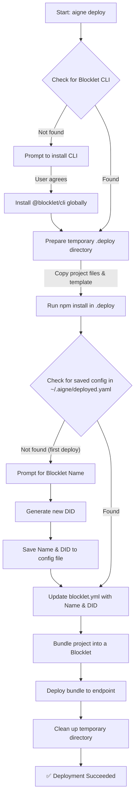

# Deploying Agents

You can package and deploy your AIGNE project as a Blocklet, a self-contained application format that runs on a Blocklet Server. This guide walks you through using the `aigne deploy` command to prepare, configure, and publish your agent for production use.

## Prerequisites

Before you begin, ensure you have the following:

- An existing AIGNE project with an `aigne.yaml` file.
- A target Blocklet Server endpoint where you have deployment permissions.
- The Blocklet CLI (`@blocklet/cli`). If you don't have it, the deployment process will offer to install it for you.

## The Deployment Command

The primary tool for deployment is the `aigne deploy` command. Its basic syntax requires specifying the project path and the target endpoint.

```bash
aigne deploy --path <project-path> --endpoint <deployment-endpoint>
```

**Parameters**

| Parameter  | Description                                                 |
|------------|-------------------------------------------------------------|
| `--path`   | Required. The local path to your AIGNE project directory.     |
| `--endpoint` | Required. The URL of the Blocklet Server to deploy to.      |

## Deployment Workflow

When you run `aigne deploy`, the CLI performs a series of automated steps to package and publish your agent. The process is designed to be interactive on the first run and non-interactive for subsequent updates.

Here is a high-level overview of the deployment process:



### Step-by-Step Guide

1.  **Initiate Deployment**

    Navigate to your project's root directory and execute the `deploy` command. For a project in the current directory, you can use `.` as the path.

    ```bash
    aigne deploy --path . --endpoint https://my-blocklet-server.com
    ```

2.  **First-Time Configuration (Interactive)**

    If this is the first time you are deploying this specific project, the CLI will guide you through a one-time setup:

    -   **Blocklet CLI Installation**: If `@blocklet/cli` is not found, you will be prompted to install it globally.
    -   **Blocklet Name**: You will be asked to provide a name for your agent Blocklet. This name will be used on the Blocklet Server. A default name based on your project folder or `aigne.yaml` configuration is suggested, which you can accept or override.

3.  **Bundling and Publishing**

    The CLI will then proceed with the automated tasks shown in the workflow diagram: preparing files, bundling the application, and uploading it to the specified endpoint. You will see progress indicators for each major step.

4.  **Subsequent Deployments**

    After the first successful deployment, the CLI saves your chosen Blocklet name and its unique DID (Decentralized Identifier) to a configuration file located at `~/.aigne/deployed.yaml`. For all future deployments of the same project (from the same local path), the CLI will use this saved information, making the process non-interactive.

Upon completion, a success message will confirm that the deployment is finished.

```bash
✅ Deploy completed: /path/to/your/project -> https://my-blocklet-server.com
```

If the process fails, an error message will indicate the cause of the failure, helping you to diagnose the issue.

---

This guide covers the standard workflow for deploying an AIGNE agent. For a detailed breakdown of all available options for the deploy command, see the [aigne deploy command reference](./command-reference-deploy.md).
