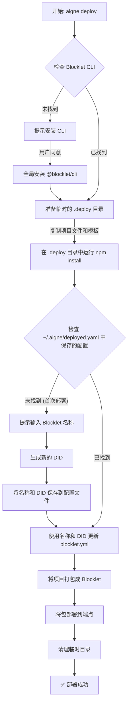

# 部署 Agent

你可以将你的 AIGNE 项目打包并部署为一个 Blocklet，这是一种在 Blocklet Server 上运行的自包含应用程序格式。本指南将引导你使用 `aigne deploy` 命令来准备、配置和发布你的 agent，以供生产环境使用。

## 前提条件

在开始之前，请确保你已具备以下条件：

- 一个包含 `aigne.yaml` 文件的现有 AIGNE 项目。
- 一个你拥有部署权限的目标 Blocklet Server 端点。
- Blocklet CLI (`@blocklet/cli`)。如果尚未安装，部署过程将提示你进行安装。

## 部署命令

部署使用的主要工具是 `aigne deploy` 命令。其基本语法要求指定项目路径和目标端点。

```bash
aigne deploy --path <project-path> --endpoint <deployment-endpoint>
```

**参数**

| Parameter  | Description                                                 |
|------------|-------------------------------------------------------------|
| `--path`   | 必需。你的 AIGNE 项目目录的本地路径。     |
| `--endpoint` | 必需。要部署到的 Blocklet Server 的 URL。      |

## 部署工作流

当你运行 `aigne deploy` 时，CLI 会执行一系列自动化步骤来打包和发布你的 agent。该过程设计为首次运行时交互式，后续更新时非交互式。

以下是部署过程的概要总览：



### 分步指南

1.  **启动部署**

    导航到你项目的根目录并执行 `deploy` 命令。对于当前目录中的项目，你可以使用 `.` 作为路径。

    ```bash
    aigne deploy --path . --endpoint https://my-blocklet-server.com
    ```

2.  **首次配置（交互式）**

    如果这是你第一次部署该特定项目，CLI 将引导你完成一次性设置：

    -   **Blocklet CLI 安装**：如果未找到 `@blocklet/cli`，系统将提示你进行全局安装。
    -   **Blocklet 名称**：系统将要求你为你的 agent Blocklet 提供一个名称。该名称将在 Blocklet Server 上使用。系统会根据你的项目文件夹或 `aigne.yaml` 配置建议一个默认名称，你可以接受或覆盖该名称。

3.  **打包和发布**

    然后，CLI 将继续执行工作流图中所示的自动化任务：准备文件、打包应用程序并将其上传到指定的端点。你将看到每个主要步骤的进度指示器。

4.  **后续部署**

    首次成功部署后，CLI 会将你选择的 Blocklet 名称及其唯一的 DID（去中心化标识符）保存到位于 `~/.aigne/deployed.yaml` 的配置文件中。对于同一项目（来自相同的本地路径）的所有未来部署，CLI 将使用此保存的信息，从而使过程非交互式。

完成后，一条成功消息将确认部署已完成。

```bash
✅ 部署完成: /path/to/your/project -> https://my-blocklet-server.com
```

如果过程失败，错误消息将指出失败原因，帮助你诊断问题。

---

本指南涵盖了部署 AIGNE agent 的标准工作流。有关 deploy 命令所有可用选项的详细分解，请参阅 [aigne deploy 命令参考](./command-reference-deploy.md)。
