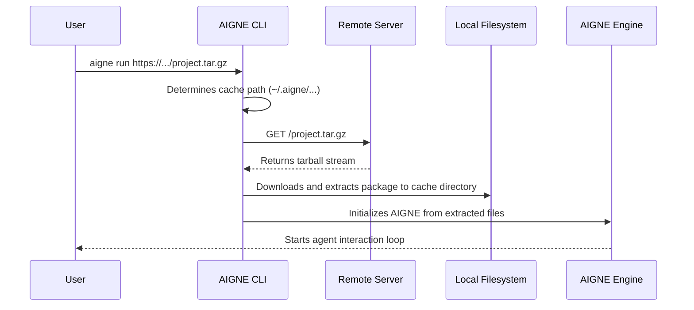

# Running Remote Agents

The AIGNE CLI can execute agents from remote locations, not just from local directories. This feature allows you to run agents directly from a URL pointing to a compressed project archive (e.g., a `.tar.gz` file). It simplifies sharing, testing, and integrating agents into automated workflows without needing to clone a repository first.

## Basic Usage

The `run` command is used for this purpose by providing a URL instead of a local file path. The remote source must be a publicly accessible tarball archive.

```bash
# Run an agent from a remote URL
aigne run https://example.com/path/to/my-aigne-project.tar.gz

# The --url alias can also be used
aigne run --url https://example.com/path/to/my-aigne-project.tar.gz
```

Once the agent is downloaded and initialized, the CLI will start an interactive chat session, just as it would with a local agent.


## How It Works

When you provide a URL, the CLI performs the following steps:

1.  **Download**: It fetches the compressed package from the specified URL.
2.  **Cache**: It creates a local directory to store the downloaded content. By default, this is located in your home directory under `~/.aigne/`, with a path derived from the URL's hostname and path.
3.  **Extract**: The tarball is uncompressed into the cache directory.
4.  **Execute**: The CLI then initializes and runs the agent from the extracted files, just as it would with a local project.

This process ensures that subsequent runs of the same URL can use the local cache, avoiding repeated downloads.



## Customizing the Cache Directory

While the default cache location in `~/.aigne/` is convenient, you can specify a custom directory for the download and extraction using the `--cache-dir` option. This is useful for isolating project dependencies or in environments like CI/CD systems where the home directory may not be persistent or accessible.

```bash
# Run a remote agent using a specific local directory for caching
aigne run --url https://example.com/my-agent.tar.gz --cache-dir ./temp-agent-cache
```

In this example, the agent package will be downloaded and extracted into a `temp-agent-cache` folder within your current working directory.

## Practical Example: Running from a GitHub Repository

You can run an agent directly from a GitHub repository's release archive or a snapshot of a specific branch or tag. GitHub and other Git platforms provide URLs to download a repository snapshot as a `.tar.gz` file.

For instance, to run an agent from the `v1.2.0` tag of a public GitHub repository:

```bash
aigne run https://github.com/AIGNE-io/example-agent/archive/refs/tags/v1.2.0.tar.gz
```

This command downloads the `v1.2.0` version of the `example-agent` repository, caches it locally, and starts the default agent defined within that project.

All other options for the `run` command, such as specifying an entry agent with `--entry-agent` or selecting a model with `--model`, are also available when running from a URL. For a full list of options, see the [`aigne run` command reference](./command-reference-run.md).