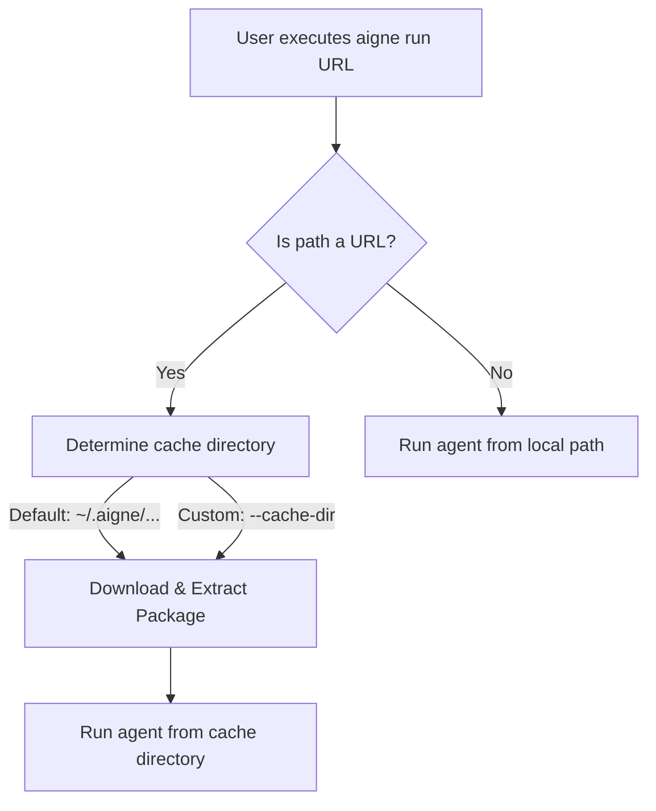

# Running Remote Agents

`@aigne/cli` allows you to execute agents directly from a remote URL, bypassing the need for manual cloning or local setup. This capability is useful for sharing reusable agents, running agents in CI/CD pipelines, or quickly testing agents from a central repository. The CLI handles the downloading, caching, and execution seamlessly.

## How It Works

When you provide a URL to the `aigne run` command, the CLI initiates a process to fetch and run the remote package. The agent code is not executed remotely; it is downloaded and run on your local machine.

Here is the workflow:



1.  **URL Detection**: The CLI identifies that the provided path is a URL (e.g., starting with `http`).
2.  **Cache Location**: It determines a local directory to store the package. By default, this is within your home directory under `~/.aigne/`, with a subpath derived from the URL to prevent conflicts. You can override this location using the `--cache-dir` option.
3.  **Download & Extract**: It fetches the compressed package (e.g., a `.tar.gz` file) from the URL and extracts its contents into the cache directory. Any existing content for that specific URL is cleared before downloading to ensure you are running the latest version from the source.
4.  **Execution**: Finally, it runs the agent from the newly populated local directory, just as it would with any local project.

## Usage

To run a remote agent, provide its URL as the primary argument to the `aigne run` command.

### Running a Default Agent

If you don't specify an agent name, the CLI will execute the first agent defined in the remote project's configuration.

```bash
# Run the default agent from a remote tarball URL
aigne run https://example.com/path/to/your/aigne-project.tar.gz
```

### Running a Specific Agent

If the remote project contains multiple agents, you can specify which one to run using the `--entry-agent` flag.

```bash
# Run a specific agent named 'data-processor' from the remote project
aigne run https://example.com/path/to/project.tar.gz --entry-agent data-processor
```

## Cache Management

The CLI's caching mechanism ensures that remote assets are stored efficiently and predictably.

### Default Cache Location

By default, packages are cached in a structured path within your home directory. For example, an agent from `https://github.com/my-org/my-agent/archive/v1.0.tar.gz` would be cached in a directory like `~/.aigne/github.com/my-org/my-agent/archive/v1.0.tar.gz`.

### Custom Cache Directory

For environments where you need precise control over file locations, such as a CI runner with a designated workspace, use the `--cache-dir` option. The package will be downloaded and extracted into this specified directory.

```bash
# Use a temporary local directory for the cache
aigne run https://example.com/path/to/project.tar.gz --cache-dir ./temp-agent-cache
```

This command will create a `./temp-agent-cache` directory and use it as the base for downloading and running the agent.

## Command Options Summary

Here are the key options for running remote agents:

| Option | Alias | Description |
|---|---|---|
| `path` (positional) | `url` | The path to the agent. Can be a local directory or a remote URL pointing to a compressed project. |
| `--entry-agent` | | Specifies the name of the agent to run. If omitted, the first agent found in the project is used. |
| `--cache-dir` | | When running from a URL, this specifies a custom directory to download and extract the package to. Overrides the default `~/.aigne` location. |

---

Running remote agents streamlines sharing and deployment. For a complete list of all runtime flags that can be combined with remote execution, see the [aigne run Command Reference](./command-reference-run.md).
