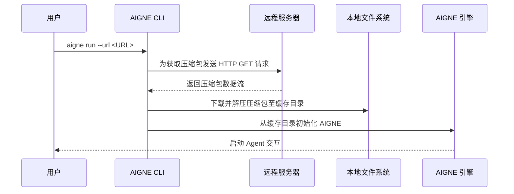

# 运行远程 Agents

AIGNE CLI 不仅可以从本地目录执行 Agent，还可以从远程位置执行。此功能允许你直接通过指向项目压缩包（例如 .tar.gz 文件）的 URL 运行 Agent。它简化了共享、测试以及将 Agent 集成到自动化工作流中的过程，无需预先克隆仓库。

## 核心命令

`run` 命令通过提供 URL（而非本地文件路径）来实现此功能。远程源必须是可公开访问的 tarball 压缩包。

```bash
# 从远程 URL 运行 Agent
aigne run --url https://example.com/path/to/my-aigne-project.tar.gz

# 你也可以使用 `path` 位置参数
aigne run https://example.com/path/to/my-aigne-project.tar.gz
```

## 工作原理

当你提供一个 URL 时，CLI 会执行以下步骤：

1.  **下载**：从指定的 URL 获取压缩包。
2.  **缓存**：创建一个本地目录来存储下载的内容。默认情况下，该目录位于你的主目录下的 `~/.aigne/` 中，其路径由 URL 派生而来。
3.  **解压**：将压缩包解压到缓存目录中。
4.  **执行**：然后，CLI 从解压后的文件中初始化并运行 Agent，就像处理本地项目一样。

此过程确保了后续使用相同 URL 运行时可以利用本地缓存，从而避免重复下载。



## 自定义缓存目录

虽然默认的缓存位置 `~/.aigne/` 很方便，但你可以使用 `--cache-dir` 选项为下载和解压指定一个自定义目录。这在隔离项目依赖或在 CI/CD 系统等主目录可能非持久化或无法访问的环境中非常有用。

```bash
# 使用指定的本地目录作为缓存来运行远程 Agent
aigne run --url https://example.com/my-agent.tar.gz --cache-dir ./temp-agent-cache
```

在此示例中，Agent 压缩包将被下载并解压到你当前工作目录下的 `temp-agent-cache` 文件夹中。

## 实践示例：从 GitHub 仓库运行

你可以直接从 GitHub 仓库的发布版本压缩包或特定分支运行 Agent。GitHub 和其他 Git 平台提供 URL，用于将仓库快照下载为 .tar.gz 文件。

例如，要从一个公共 GitHub 仓库的 `v1.2.0` 标签运行 Agent：

```bash
aigne run --url https://github.com/AIGNE-io/example-agent/archive/refs/tags/v1.2.0.tar.gz
```

此命令会下载 `example-agent` 仓库的 `v1.2.0` 版本，将其缓存在本地，并启动项目内定义的默认 Agent。

---

`run` 命令的所有其他选项，如使用 `--entry-agent` 指定入口 Agent 或使用 `--model` 选择模型，在从 URL 运行时同样可用。有关完整的选项列表，请参阅 [`aigne run` 命令参考](./command-reference-run.md)。