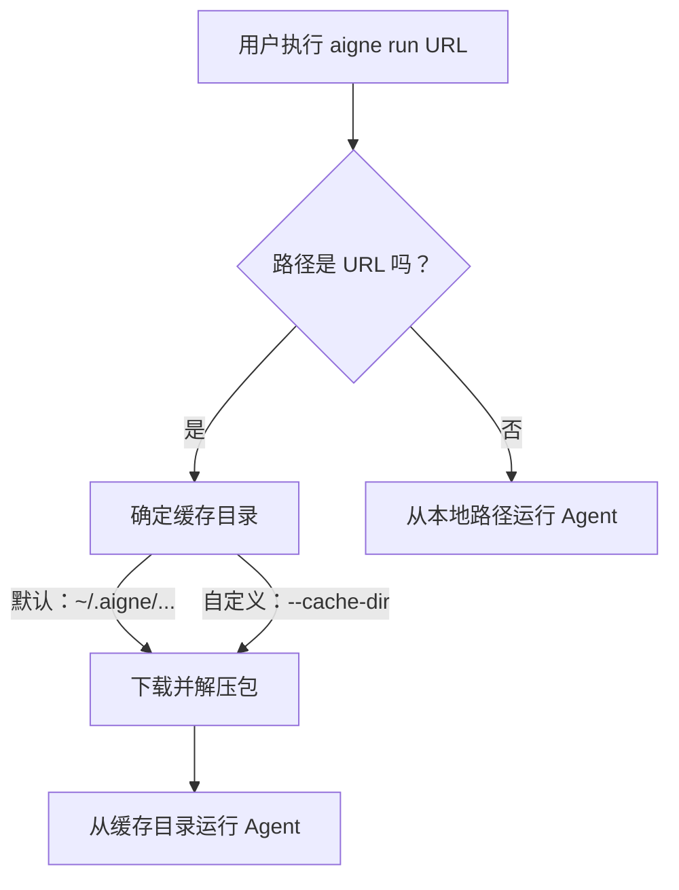

# 运行远程 Agent

`@aigne/cli` 允许你直接从远程 URL 执行 Agent，无需手动克隆或进行本地设置。此功能有助于共享可复用的 Agent、在 CI/CD 管道中运行 Agent，或从中央存储库快速测试 Agent。CLI 会无缝处理下载、缓存和执行过程。

## 工作原理

当你向 `aigne run` 命令提供一个 URL 时，CLI 会启动一个进程来获取并运行该远程包。Agent 代码不会在远程执行，而是会下载到你的本地计算机上运行。

工作流程如下：



1.  **URL 检测**：CLI 会识别出所提供的路径是一个 URL（例如，以 `http` 开头）。
2.  **缓存位置**：CLI 会确定一个本地目录来存储包。默认情况下，该目录位于你的主目录下的 `~/.aigne/` 中，其子路径根据 URL派生，以防止冲突。你可以使用 `--cache-dir` 选项覆盖此位置。
3.  **下载与解压**：CLI 从 URL 获取压缩包（例如，`.tar.gz` 文件）并将其内容解压到缓存目录中。在下载之前，该特定 URL 的任何现有内容都将被清除，以确保你运行的是源端的最新版本。
4.  **执行**：最后，CLI 会从新填充的本地目录中运行该 Agent，就像运行任何本地项目一样。

## 使用方法

要运行远程 Agent，请将其 URL 作为主要参数提供给 `aigne run` 命令。

### 运行默认 Agent

如果你未指定 Agent 名称，CLI 将执行远程项目配置中定义的第一个 Agent。

```bash
# 从远程 tarball URL 运行默认 Agent
aigne run https://example.com/path/to/your/aigne-project.tar.gz
```

### 运行特定 Agent

如果远程项目包含多个 Agent，你可以使用 `--entry-agent` 标志指定要运行哪一个。

```bash
# 从远程项目运行名为 'data-processor' 的特定 Agent
aigne run https://example.com/path/to/project.tar.gz --entry-agent data-processor
```

## 缓存管理

CLI 的缓存机制可确保远程资产得到高效、可预测的存储。

### 默认缓存位置

默认情况下，软件包会缓存在你主目录下的结构化路径中。例如，来自 `https://github.com/my-org/my-agent/archive/v1.0.tar.gz` 的 Agent 将被缓存在类似 `~/.aigne/github.com/my-org/my-agent/archive/v1.0.tar.gz` 的目录中。

### 自定义缓存目录

对于需要精确控制文件位置的环境（例如具有指定工作空间的 CI 运行器），请使用 `--cache-dir` 选项。软件包将被下载并解压到此指定目录中。

```bash
# 使用一个临时的本地目录作为缓存
aigne run https://example.com/path/to/project.tar.gz --cache-dir ./temp-agent-cache
```

此命令将创建一个 `./temp-agent-cache` 目录，并将其用作下载和运行 Agent 的基础目录。

## 命令选项摘要

以下是运行远程 Agent 的关键选项：

| Option | Alias | Description |
|---|---|---|
| `path` (位置参数) | `url` | Agent 的路径。可以是本地目录，也可以是指向压缩项目的远程 URL。 |
| `--entry-agent` | | 指定要运行的 Agent 的名称。如果省略，则使用项目中找到的第一个 Agent。 |
| `--cache-dir` | | 当从 URL 运行时，此选项指定用于下载和解压包的自定义目录。它会覆盖默认的 `~/.aigne` 位置。 |

---

运行远程 Agent 可以简化共享和部署。有关可与远程执行结合使用的所有运行时标志的完整列表，请参阅 [aigne run 命令参考](./command-reference-run.md)。