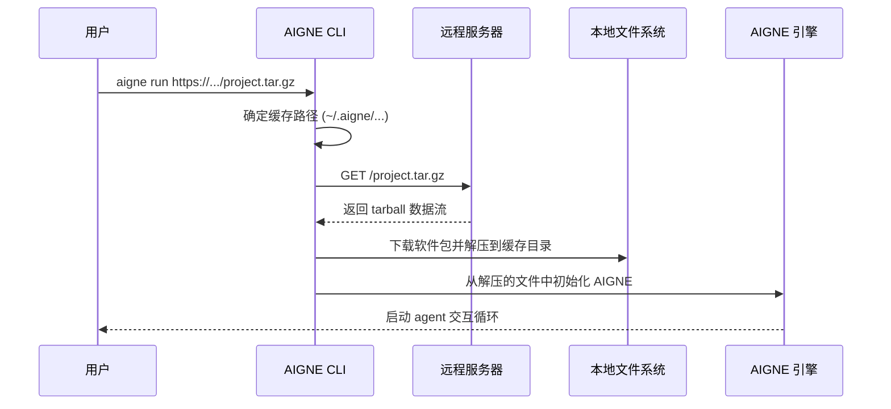

# 运行远程 Agent

AIGNE CLI 不仅可以从本地目录执行 agent，还可以从远程位置执行。此功能允许您直接从指向压缩项目归档文件（例如 .tar.gz 文件）的 URL 运行 agent。它简化了 agent 的共享、测试以及将其集成到自动化工作流中的过程，无需先克隆仓库。

## 基本用法

`run` 命令通过提供 URL 而非本地文件路径来实现此目的。远程源必须是可公开访问的 tarball 归档文件。

```bash
# 从远程 URL 运行 agent
aigne run https://example.com/path/to/my-aigne-project.tar.gz

# 也可以使用 --url 别名
aigne run --url https://example.com/path/to/my-aigne-project.tar.gz
```

下载并初始化 agent 后，CLI 将启动一个交互式聊天会话，就像处理本地 agent 一样。


## 工作原理

当您提供一个 URL 时，CLI 会执行以下步骤：

1.  **下载**：从指定的 URL 获取压缩包。
2.  **缓存**：创建一个本地目录来存储下载的内容。默认情况下，该目录位于您的主目录下的 `~/.aigne/` 中，其路径由 URL 的主机名和路径派生而来。
3.  **解压**：将 tarball 解压缩到缓存目录中。
4.  **执行**：然后，CLI 从解压后的文件中初始化并运行 agent，就像处理本地项目一样。

此过程确保后续运行相同的 URL 时可以使用本地缓存，从而避免重复下载。



## 自定义缓存目录

虽然默认的缓存位置在 `~/.aigne/` 中很方便，但您可以使用 `--cache-dir` 选项指定一个自定义目录用于下载和解压。这对于隔离项目依赖项或在主目录可能不是持久性或不可访问的 CI/CD 系统等环境中非常有用。

```bash
# 使用特定的本地目录作为缓存来运行远程 agent
aigne run --url https://example.com/my-agent.tar.gz --cache-dir ./temp-agent-cache
```

在此示例中，agent 软件包将被下载并解压到当前工作目录下的 `temp-agent-cache` 文件夹中。

## 实际示例：从 GitHub 仓库运行

您可以直接从 GitHub 仓库的发布归档文件或特定分支或标签的快照运行 agent。GitHub 和其他 Git 平台提供 URL，可将仓库快照下载为 .tar.gz 文件。

例如，要从一个公共 GitHub 仓库的 `v1.2.0` 标签运行 agent：

```bash
aigne run https://github.com/AIGNE-io/example-agent/archive/refs/tags/v1.2.0.tar.gz
```

此命令会下载 `example-agent` 仓库的 `v1.2.0` 版本，将其缓存在本地，并启动该项目中定义的默认 agent。

`run` 命令的所有其他选项，例如使用 `--entry-agent` 指定入口 agent 或使用 `--model` 选择模型，在从 URL 运行时也同样可用。有关选项的完整列表，请参阅 [`aigne run` 命令参考](./command-reference-run.md)。