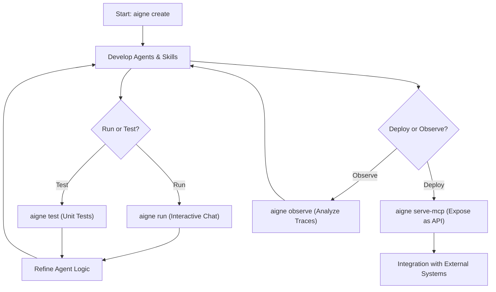

# Overview

  <picture>
    <source srcset="https://raw.githubusercontent.com/AIGNE-io/aigne-framework/main/packages/cli/logo-dark.svg" media="(prefers-color-scheme: dark)">
    <source srcset="https://raw.githubusercontent.com/AIGNE-io/aigne-framework/main/packages/cli/logo.svg" media="(prefers-color-scheme: light)">
    
  </picture>

  
Your command center for agent development

`@aigne/cli` is the official command-line tool for the [AIGNE Framework](https://github.com/AIGNE-io/aigne-framework). It provides a comprehensive suite of commands to streamline the entire lifecycle of agent development, from initial project creation to testing, deployment, and monitoring.

The CLI is designed to provide a structured and efficient workflow for building, testing, and serving AI agents. The following diagram illustrates a typical development cycle using `@aigne/cli`:

## Key Features

`@aigne/cli` equips you with the necessary tools to manage your agent projects effectively:

*   **Project Scaffolding**: Quickly create new AIGNE projects with `aigne create`. This command sets up a standardized file structure and configuration, letting you focus on building agents immediately.
*   **Interactive Agent Execution**: Run and test your agents in a local, interactive chat loop using `aigne run`. This command supports executing agents from your local file system or directly from a remote URL.
*   **Automated Testing**: Use `aigne test` to run unit and integration tests for your agents and skills, ensuring code quality and reliability.
*   **MCP Server Deployment**: Expose your agents as a service with `aigne serve-mcp`. This command starts a server that conforms to the Model Context Protocol (MCP), allowing for standardized integration with external systems.
*   **Execution Observability**: Launch a local monitoring service with `aigne observe` to view and analyze detailed execution traces of your agent's behavior, which simplifies debugging and optimization.
*   **Multi-Model Support**: Flexibly switch between different AI model providers like OpenAI, Claude, and XAI to find the best fit for your application's needs.

<picture>
  <source srcset="https://raw.githubusercontent.com/AIGNE-io/aigne-framework/main/assets/aigne-cli-dark.png" media="(prefers-color-scheme: dark)">
  <source srcset="https://raw.githubusercontent.com/AIGNE-io/aigne-framework/main/assets/aigne-cli.png" media="(prefers-color-scheme: light)">
  
</picture>

---

Ready to get started? Proceed to the [Getting Started](./getting-started.md) guide to install the CLI and build your first agent.