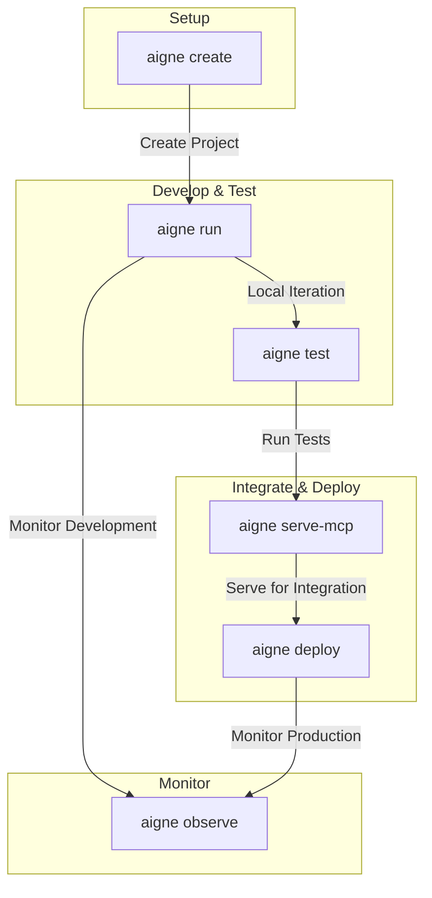

# Overview

`@aigne/cli` is the official command-line tool for the AIGNE Framework. It acts as your command center for agent development, designed to simplify the entire lifecycle from creation and testing to deployment and monitoring.

<picture>
  <source srcset="https://raw.githubusercontent.com/AIGNE-io/aigne-framework/main/assets/aigne-cli-dark.png" media="(prefers-color-scheme: dark)">
  <source srcset="https://raw.githubusercontent.com/AIGNE-io/aigne-framework/main/assets/aigne-cli.png" media="(prefers-color-scheme: light)">
  
</picture>

## The Development Workflow

The CLI provides commands that map directly to the agent development lifecycle, from initial setup to production deployment.

## Key Features

*   **Project Scaffolding**: Quickly create new AIGNE projects with predefined file structures and configurations using the `aigne create` command.
*   **Local Agent Execution**: Easily run and test AIGNE agents in a local chat loop with `aigne run`.
*   **Automated Testing**: A built-in `aigne test` command supports unit and integration testing for your agents and skills.
*   **MCP Service**: Launch agents as a Model Context Protocol (MCP) server with `aigne serve-mcp` for seamless integration with external systems.
*   **Observability**: Start a local server with `aigne observe` to view and analyze agent execution traces and performance data.
*   **Multi-model Support**: Natively supports various model providers, including OpenAI, Claude, and XAI.

This overview covers the main capabilities of `@aigne/cli`. To start building, proceed to the installation and setup guide.

[Next: Getting Started](./getting-started.md)