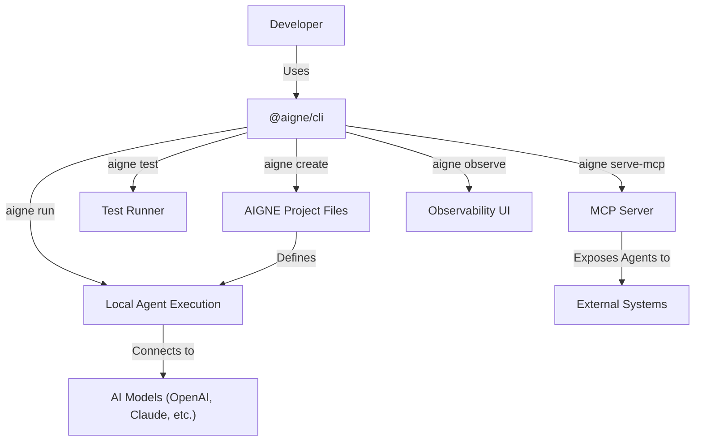

# Overview

  <picture>
    <source srcset="https://raw.githubusercontent.com/AIGNE-io/aigne-framework/main/packages/cli/logo-dark.svg" media="(prefers-color-scheme: dark)">
    <source srcset="https://raw.githubusercontent.com/AIGNE-io/aigne-framework/main/packages/cli/logo.svg" media="(prefers-color-scheme: light)">
    
  </picture>

  
Your command center for agent development

`@aigne/cli` is the official command-line tool for the [AIGNE Framework](https://github.com/AIGNE-io/aigne-framework). It is designed to streamline the entire lifecycle of agent development, from initial project scaffolding to local testing, and final deployment. The CLI provides a suite of commands that automate common tasks, manage project configurations, and offer a consistent and efficient development workflow.

Whether you are building a simple agent or a complex multi-agent system, `@aigne/cli` serves as your primary interface for interacting with the AIGNE framework, simplifying an otherwise complex process.

## Core Features

`@aigne/cli` is equipped with several features to support agent development:

*   **Project Scaffolding**: Quickly create new AIGNE projects with a standardized file structure and configuration, letting you focus on building agent logic from day one.
*   **Local Agent Execution**: Run and interact with your agents directly from the command line in a chat loop, making it easy to test and debug behavior.
*   **Automated Testing**: Includes a built-in test runner for executing unit and integration tests for your agents and skills.
*   **MCP Server**: Expose your agents as a Model Context Protocol (MCP) server, enabling seamless integration with other applications and services.
*   **Observability**: Launch a local server to view and analyze detailed execution traces, providing insights into your agent's performance and decision-making process.
*   **Multi-Model Support**: Natively supports various AI model providers, including OpenAI, Claude, and XAI, allowing you to switch between models with ease.

## How It Works

The CLI acts as the central controller for your AIGNE projects. It reads your project's `aigne.yaml` configuration to understand your agents, skills, and model settings, and then uses this information to execute commands.

This workflow enables a rapid development cycle where you can define, run, and test agents efficiently from a single command-line interface.

<picture>
  <source srcset="https://raw.githubusercontent.com/AIGNE-io/aigne-framework/main/assets/aigne-cli-dark.png" media="(prefers-color-scheme: dark)">
  <source srcset="https://raw.githubusercontent.com/AIGNE-io/aigne-framework/main/assets/aigne-cli.png" media="(prefers-color-scheme: light)">
  
</picture>

## Next Steps

Now that you have an overview of what `@aigne/cli` can do, you are ready to install it and create your first project. Proceed to the [Getting Started](./getting-started.md) guide for a step-by-step tutorial.
