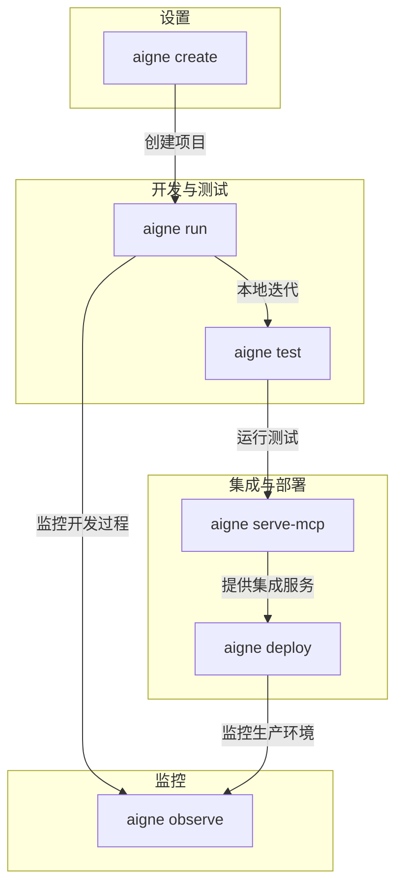

# 概述

`@aigne/cli` 是 AIGNE 框架的官方命令行工具。它充当您 Agent 开发的指挥中心，旨在简化从创建、测试到部署和监控的整个生命周期。

<picture>
  <source srcset="https://raw.githubusercontent.com/AIGNE-io/aigne-framework/main/assets/aigne-cli-dark.png" media="(prefers-color-scheme: dark)">
  <source srcset="https://raw.githubusercontent.com/AIGNE-io/aigne-framework/main/assets/aigne-cli.png" media="(prefers-color-scheme: light)">
  
</picture>

## 开发工作流

该 CLI 提供的命令直接映射 Agent 开发生命周期，涵盖从初始设置到生产部署的各个阶段。

## 主要特性

*   **项目脚手架**：使用 `aigne create` 命令，通过预定义的文件结构和配置快速创建新的 AIGNE 项目。
*   **本地 Agent 执行**：使用 `aigne run`，可在本地聊天循环中轻松运行和测试 AIGNE Agent。
*   **自动化测试**：内置的 `aigne test` 命令支持对您的 Agent 和技能进行单元测试与集成测试。
*   **MCP 服务**：使用 `aigne serve-mcp` 将 Agent 作为模型上下文协议 (MCP) 服务器启动，以实现与外部系统的无缝集成。
*   **可观察性**：使用 `aigne observe` 启动本地服务器，以查看和分析 Agent 的执行追踪和性能数据。
*   **多模型支持**：原生支持多种模型提供商，包括 OpenAI、Claude 和 XAI。

本概述涵盖了 `@aigne/cli` 的主要功能。如需开始构建，请继续阅读安装和设置指南。

[下一步：快速入门](./getting-started.md)