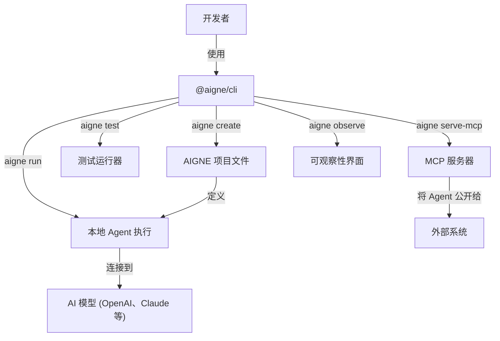

# 概述

  <picture>
    <source srcset="https://raw.githubusercontent.com/AIGNE-io/aigne-framework/main/packages/cli/logo-dark.svg" media="(prefers-color-scheme: dark)">
    <source srcset="https://raw.githubusercontent.com/AIGNE-io/aigne-framework/main/packages/cli/logo.svg" media="(prefers-color-scheme: light)">
    
  </picture>

  
你的 Agent 开发指挥中心

`@aigne/cli` 是 [AIGNE 框架](https://github.com/AIGNE-io/aigne-framework) 的官方命令行工具。它旨在简化 Agent 开发的整个生命周期，从初始项目脚手架搭建、本地测试到最终部署。该 CLI 提供了一套命令，可自动化执行常见任务、管理项目配置，并提供一致高效的开发工作流。

无论你是在构建一个简单的 Agent 还是一个复杂的多 Agent 系统，`@aigne/cli` 都能作为你与 AIGNE 框架交互的主要接口，从而简化原本复杂的过程。

## 核心功能

`@aigne/cli` 具备多项功能以支持 Agent 开发：

*   **项目脚手架**：快速创建具有标准化文件结构和配置的新 AIGNE 项目，让你从第一天起就能专注于构建 Agent 逻辑。
*   **本地 Agent 执行**：在聊天循环中，直接从命令行运行你的 Agent 并与之交互，方便测试和调试其行为。
*   **自动化测试**：内置测试运行器，可为你的 Agent 和技能执行单元测试和集成测试。
*   **MCP 服务器**：将你的 Agent 作为模型上下文协议 (MCP) 服务器公开，从而实现与其他应用程序和服务的无缝集成。
*   **可观察性**：启动本地服务器以查看和分析详细的执行跟踪，从而深入了解 Agent 的性能和决策过程。
*   **多模型支持**：原生支持 OpenAI、Claude 和 XAI 等多种 AI 模型提供商，让你能够轻松地在不同模型间切换。

## 工作原理

CLI 充当 AIGNE 项目的中央控制器。它会读取项目的 `aigne.yaml` 配置文件，以了解你的 Agent、技能和模型设置，然后使用这些信息来执行命令。

这种工作流可以实现快速的开发周期，让你能够通过单一的命令行界面高效地定义、运行和测试 Agent。

<picture>
  <source srcset="https://raw.githubusercontent.com/AIGNE-io/aigne-framework/main/assets/aigne-cli-dark.png" media="(prefers-color-scheme: dark)">
  <source srcset="https://raw.githubusercontent.com/AIGNE-io/aigne-framework/main/assets/aigne-cli.png" media="(prefers-color-scheme: light)">
  
</picture>

## 后续步骤

既然你已对 `@aigne/cli` 的功能有了大致了解，就可以着手安装并创建你的第一个项目了。请继续阅读 [入门指南](./getting-started.md) 以获取分步教程。