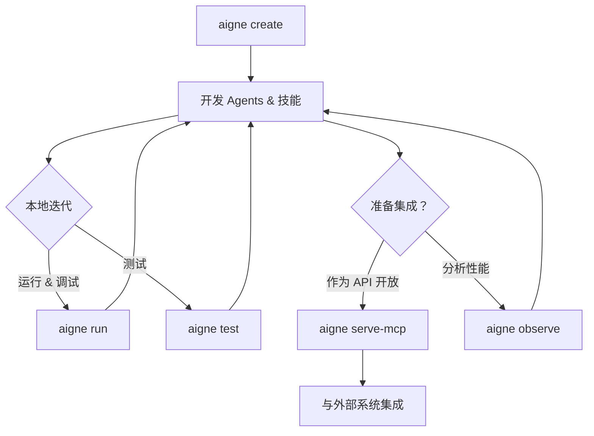

# 概述

  <picture>
    <source srcset="https://raw.githubusercontent.com/AIGNE-io/aigne-framework/main/packages/cli/logo-dark.svg" media="(prefers-color-scheme: dark)">
    <source srcset="https://raw.githubusercontent.com/AIGNE-io/aigne-framework/main/packages/cli/logo.svg" media="(prefers-color-scheme: light)">
    
  </picture>

  
你的 Agent 开发指挥中心

`@aigne/cli` 是 [AIGNE 框架](https://github.com/AIGNE-io/aigne-framework) 的官方命令行工具。它提供了一整套命令，旨在简化从项目创建到测试、部署和监控的整个 agent 开发生命周期。

该 CLI 旨在为构建、测试和提供 AI agents 提供一个结构化且高效的工作流。下图展示了一个典型的开发周期：

## 主要特性

`@aigne/cli` 为你提供了有效管理 agent 项目所需的工具：

*   **项目脚手架**：使用 [`aigne create`](./command-reference-create.md) 快速搭建一个具有标准化文件结构和配置的 AIGNE 新项目。
*   **交互式 Agent 执行**：使用 [`aigne run`](./command-reference-run.md) 在本地交互式聊天循环中运行和测试你的 agents。该命令支持从本地文件系统或直接从远程 URL 执行 agents。
*   **自动化测试**：使用 [`aigne test`](./command-reference-test.md) 为你的 agents 和技能运行单元测试和集成测试，确保代码质量和可靠性。
*   **API 服务器部署**：使用 [`aigne serve-mcp`](./command-reference-serve-mcp.md) 将你的 agents 作为服务开放。该命令会启动一个符合模型上下文协议（MCP）的服务器，从而实现与外部系统的标准化集成。
*   **执行可观测性**：使用 [`aigne observe`](./command-reference-observe.md) 启动本地监控服务，以查看和分析你的 agent 行为的详细执行轨迹，从而简化调试和优化过程。
*   **多模型支持**：在 OpenAI、Claude 和 XAI 等不同的人工智能模型提供商之间灵活切换，以找到最适合你应用程序需求的模型。

---

准备好开始了吗？请继续阅读[入门指南](./getting-started.md)以安装 CLI 并构建你的第一个 agent。
