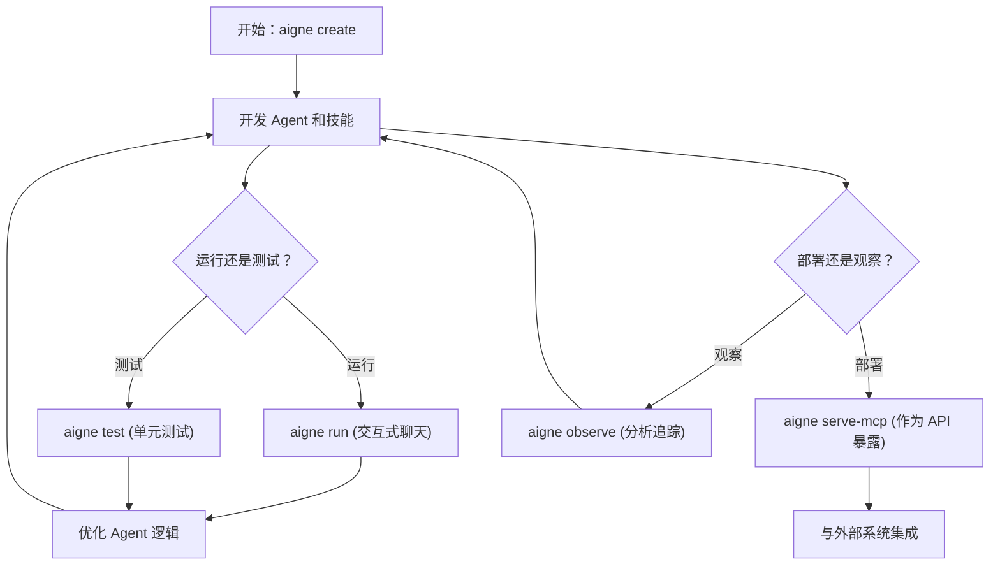

# 概述

  <picture>
    <source srcset="https://raw.githubusercontent.com/AIGNE-io/aigne-framework/main/packages/cli/logo-dark.svg" media="(prefers-color-scheme: dark)">
    <source srcset="https://raw.githubusercontent.com/AIGNE-io/aigne-framework/main/packages/cli/logo.svg" media="(prefers-color-scheme: light)">
    
  </picture>

  
你的 Agent 开发指挥中心

`@aigne/cli` 是 [AIGNE 框架](https://github.com/AIGNE-io/aigne-framework) 的官方命令行工具。它提供了一套全面的命令，以简化从初始项目创建到测试、部署和监控的整个 Agent 开发生命周期。

该 CLI 旨在为构建、测试和提供 AI Agent 提供结构化且高效的工作流程。下图说明了使用 `@aigne/cli` 的典型开发周期：

## 主要功能

`@aigne/cli` 为您提供了有效管理 Agent 项目所需的工具：

*   **项目脚手架**：使用 `aigne create` 快速创建新的 AIGNE 项目。此命令会建立标准化的文件结构和配置，让您能够立即专注于构建 Agent。
*   **交互式 Agent 执行**：使用 `aigne run` 在本地的交互式聊天循环中运行和测试您的 Agent。此命令支持从本地文件系统或直接从远程 URL 执行 Agent。
*   **自动化测试**：使用 `aigne test` 为您的 Agent 和技能运行单元和集成测试，确保代码质量和可靠性。
*   **MCP 服务器部署**：使用 `aigne serve-mcp` 将您的 Agent 作为服务暴露。此命令会启动一个符合模型上下文协议 (MCP) 的服务器，从而实现与外部系统的标准化集成。
*   **执行可观察性**：使用 `aigne observe` 启动本地监控服务，以查看和分析您 Agent 行为的详细执行追踪，从而简化调试和优化。
*   **多模型支持**：在 OpenAI、Claude 和 XAI 等不同的 AI 模型提供商之间灵活切换，以找到最适合您应用程序需求的模型。

<picture>
  <source srcset="https://raw.githubusercontent.com/AIGNE-io/aigne-framework/main/assets/aigne-cli-dark.png" media="(prefers-color-scheme: dark)">
  <source srcset="https://raw.githubusercontent.com/AIGNE-io/aigne-framework/main/assets/aigne-cli.png" media="(prefers-color-scheme: light)">
  
</picture>

---

准备好开始了吗？请继续阅读 [入门指南](./getting-started.md) 以安装 CLI 并构建您的第一个 Agent。