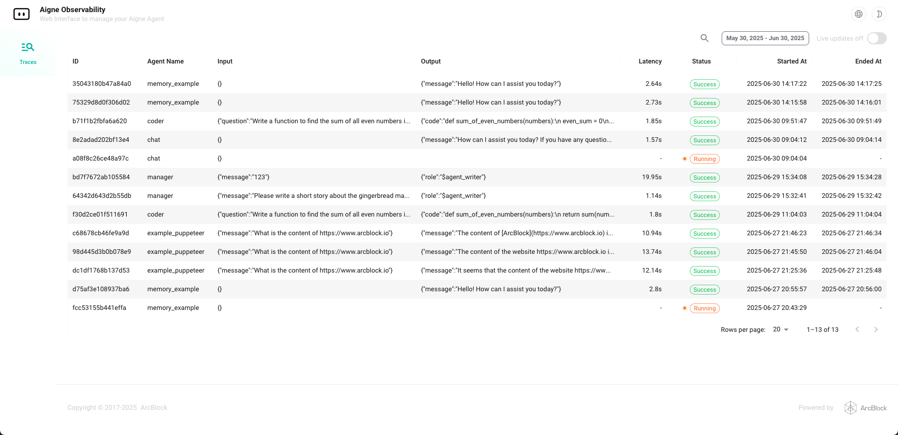
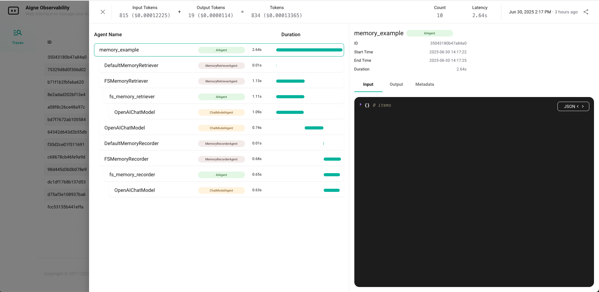

# AIGNE Observability

A visual tool for monitoring the data flow of Agents, built on OpenTelemetry. Supports collection of both Trace and Log data. Can be used as a standalone service or integrated into the agent runtime.

  


---

## ✨ Features

- 📊 Real-time visualization of trace data and call chains
- 🔍 Accurately pinpoint agent internal workflows
- ☁️ Supports both local CLI and Blocklet deployment
- 💾 Uses SQLite as the default backend storage

---

## 🛠 Installation & Usage

You can use AIGNE Observability in two ways: via **Blocklet** or **CLI**.

### ✅ Option 1: Use as a Blocklet

```bash
# Launch directly from Blocklet Store
https://store.blocklet.dev/blocklets/z2qa2GCqPJkufzqF98D8o7PWHrRRSHpYkNhEh

# Or install it into an existing Blocklet environment
https://store.blocklet.dev/blocklets/z2qa2GCqPJkufzqF98D8o7PWHrRRSHpYkNhEh

# Once installed, run your agine service,
# and you can view trace data directly inside this Blocklet
```

### Option 2: Use Locally via CLI
```bash
npm install -g @aigne/cli

# Start your agent
aigne run xxx

# Launch the observability dashboard
aigne observe
```

### ⚙️ Development Mode
```bash
# Install the Blocklet Server (if not already installed)
https://www.arcblock.io/docs/blocklet-developer/en/install-blocklet-cli

# Start the observability Blocklet
cd blocklet/observability
blocklet dev
```